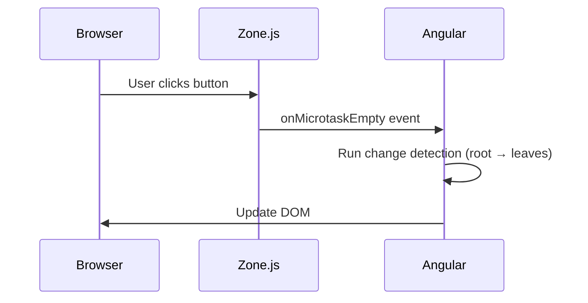
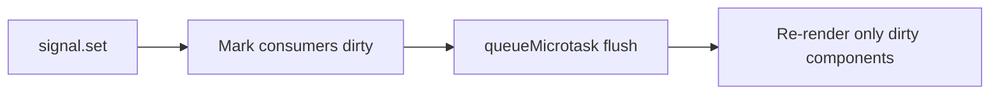

# Angular Change Detection

## Introduction

Change detection is Angular's mechanism for keeping the DOM in sync with component state. After every asynchronous event — a click, an HTTP response, a setTimeout — Angular checks whether component data has changed and updates the view if it has.

Understanding change detection is the single most important performance topic in Angular. Getting it wrong means unnecessary renders on every keypress. Getting it right means surgical updates that touch only what changed.

---

## Why it matters

- The difference between Default and OnPush can be 10–100× fewer checks in large component trees
- Memory leaks from Zone.js patching cause subtle bugs in SSR
- Signals fundamentally change how Angular schedules updates — essential interview topic in 2025

---

## How Change Detection is Triggered

Angular uses **Zone.js** to intercept all async browser APIs and know when to run change detection:



Zone.js patches: `setTimeout`, `setInterval`, `Promise`, `addEventListener`, `XMLHttpRequest`, `fetch`, `MutationObserver`. When any of these complete, Zone.js notifies Angular's `NgZone`, which triggers change detection.

---

## Default Strategy — Check Everything

```typescript
@Component({
  changeDetection: ChangeDetectionStrategy.Default, // implicit
  template: `<p>{{ value }}</p>`,
})
export class MyComponent {
  value = 'hello';
}
```

With Default, Angular walks the entire component tree after every event and checks every component, regardless of whether their inputs changed. For a tree of 100 components, a single button click runs 100 checks.

---

## OnPush Strategy — Check Only When Necessary

```typescript
@Component({
  changeDetection: ChangeDetectionStrategy.OnPush,
  template: `<p>{{ user().name }}</p>`,
})
export class UserCardComponent {
  user = input.required<User>();
}
```

Angular skips this component unless **one of these conditions is met**:

1. An `input()` signal value changes (new reference, not mutation)
2. A DOM event fires from within this component or its children
3. An `Observable` bound with `async` pipe emits
4. `ChangeDetectorRef.markForCheck()` is called manually
5. A signal read in the template emits a new value

**Rule: use OnPush on every component. No exceptions.**

---

## The Immutability Requirement

OnPush only detects reference changes on inputs, not mutations:

```typescript
// BAD — OnPush won't detect this
this.users.push(newUser);          // same array reference

// GOOD — new reference triggers OnPush
this.users = [...this.users, newUser];

// BEST — use signals; Angular handles this automatically
this.users.update(list => [...list, newUser]);
```

---

## Signals and Change Detection

Signals bypass Zone.js entirely. Each signal tracks which template expressions read it. When a signal is written, Angular marks only those specific components dirty and schedules a flush via `queueMicrotask()`:



```typescript
@Component({
  // OnPush is still recommended even with signals
  changeDetection: ChangeDetectionStrategy.OnPush,
  template: `<span>{{ count() }}</span>`,
})
export class CounterComponent {
  count = signal(0);

  increment() {
    // Only this component re-renders — no Zone.js involvement
    this.count.update(n => n + 1);
  }
}
```

---

## ChangeDetectorRef API

```typescript
@Component({
  changeDetection: ChangeDetectionStrategy.OnPush,
})
export class RealtimeComponent implements OnInit {
  private readonly cdr = inject(ChangeDetectorRef);
  data = signal<Data | null>(null);

  ngOnInit() {
    // WebSocket callback runs outside Angular's zone
    this.wsService.messages$.subscribe(msg => {
      this.data.set(msg);
      // Signal handles this automatically, but if using plain properties:
      // this.cdr.markForCheck();
    });
  }
}
```

| Method | What it does | When to use |
|---|---|---|
| `markForCheck()` | Marks component and ancestors dirty — runs on next CD cycle | OnPush + external async (WebSocket, plain setTimeout) |
| `detectChanges()` | Runs CD synchronously for this subtree | After programmatic focus, imperative rendering |
| `detach()` | Removes component from CD tree entirely | Manual control, virtual scroll, high-frequency updates |
| `reattach()` | Re-adds to CD tree | After detach |

---

## Running Outside Zone.js

For high-frequency events (WebSocket frames, scroll events, resize), run outside Zone.js to prevent triggering CD on every event:

```typescript
@Component({ changeDetection: ChangeDetectionStrategy.OnPush })
export class ChartComponent implements OnInit {
  private readonly ngZone = inject(NgZone);
  private readonly cdr = inject(ChangeDetectorRef);
  chartData = signal<number[]>([]);

  ngOnInit() {
    this.ngZone.runOutsideAngular(() => {
      // This WebSocket callback won't trigger CD
      this.wsService.priceUpdates$.subscribe(price => {
        // Use signal — it knows how to schedule its own update
        this.chartData.update(data => [...data, price].slice(-100));
      });
    });
  }
}
```

---

## Zoneless Angular (Future)

Angular is working toward removing Zone.js entirely. With `provideExperimentalZonelessChangeDetection()`:

```typescript
bootstrapApplication(AppComponent, {
  providers: [
    provideExperimentalZonelessChangeDetection(),
  ],
});
```

All change detection is driven by signals. No Zone.js patching, no `app.module.ts` importing `zone.js`. This is the direction Angular is heading — understanding signals now is mandatory.

---

## Interview Questions

**Q (Easy): What is the difference between Default and OnPush change detection?**

Default checks every component in the tree after every async event — reliable but expensive. OnPush skips a component unless its inputs change by reference, an event originates in it, an async pipe emits, or `markForCheck()` is called explicitly. OnPush reduces unnecessary checks dramatically. Use it everywhere.

**Q (Medium): Why does mutating an object not trigger OnPush change detection?**

OnPush compares input references, not values. If you mutate an array (`arr.push(item)`), the reference is the same object — Angular sees the same reference and skips the component. You must replace the reference (`arr = [...arr, item]`) for Angular to detect the change. Signals solve this: `signal.update()` creates a new signal version that Angular's reactive graph tracks precisely.

**Q (Hard): How does Zone.js know when to trigger change detection after an XHR completes?**

Zone.js wraps `XMLHttpRequest.prototype.send` and `addEventListener` at application startup. When Angular boots, `bootstrapApplication` (or `platformBrowserDynamic`) runs inside a zone. Zone.js intercepts the XHR send, tracks it as an ongoing async operation, and waits for the load/error event. When the event fires, Zone.js's `onMicrotaskEmpty` hook fires, which `NgZone` subscribes to. `NgZone` calls `ApplicationRef.tick()`, which runs change detection from the root.

**Q (Senior): How do signals change the change detection contract versus Zone.js?**

Zone.js is implicit and global — any async operation in any code can trigger a full CD pass. Signals are explicit and granular — only components that read a specific signal are re-rendered when it changes. Zone.js requires Angular to know "something happened, check everything." Signals make Angular know "signal X changed, only components A, C, and F read it — re-render only those." This eliminates unnecessary checks, enables zoneless Angular, improves SSR compatibility, and makes performance predictable.

---

## 30-Second Answer

Angular uses Zone.js to intercept all async operations and trigger change detection. Default strategy checks every component; OnPush checks only when inputs change by reference, an event fires, or `markForCheck()` is called. Use OnPush everywhere. Signals bypass Zone.js — when a signal changes, Angular re-renders only the components that read it, making updates surgical and predictable.

---

## Cheat Sheet

```
Trigger CD:
  Zone.js (Default)     → any async: setTimeout, Promise, XHR, click
  OnPush triggers       → input ref change, DOM event, async pipe, markForCheck()
  Signals               → signal.set/update → mark consumers dirty → flush

ChangeDetectorRef:
  markForCheck()        → mark dirty, run next CD cycle
  detectChanges()       → run synchronously now
  detach() / reattach() → opt out / opt back in

Immutability for OnPush:
  Mutation:   this.items.push(x)        → NOT detected
  Replace:    this.items = [...items, x] → detected
  Signal:     items.update(l => [...l, x]) → always detected

Zoneless:
  provideExperimentalZonelessChangeDetection()
  All updates driven by signals — no Zone.js required
```

---

## Related Topics

- **Previous:** [Angular Signals](./signals)
- **Next:** [OnPush Strategy](./onpush-strategy)
- **Related:** [JavaScript Event Loop](/docs/javascript/event-loop)
- **Related:** [Angular Performance](./bundle-optimization)
