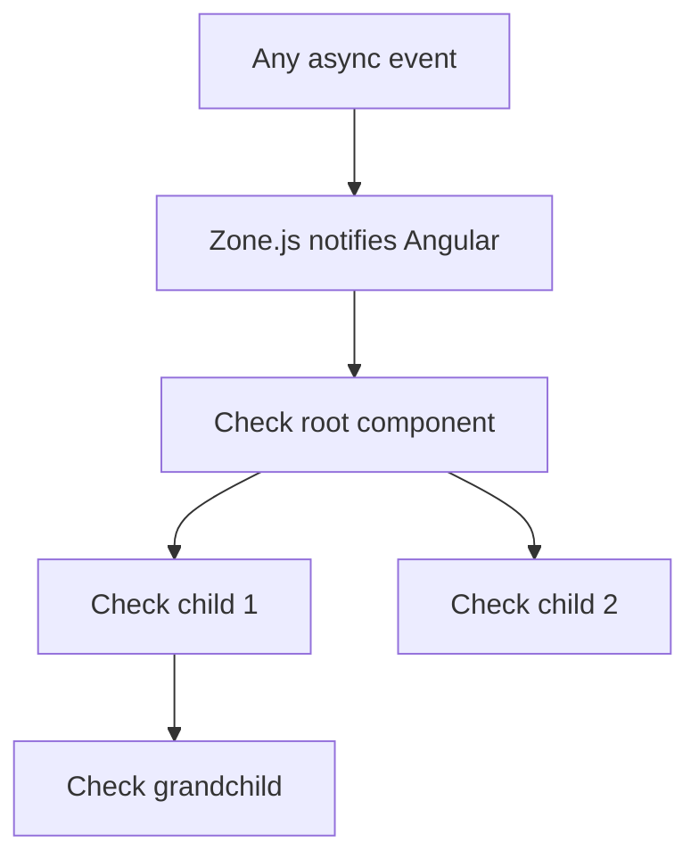

# Angular Change Detection

## Introduction

Change detection is how Angular knows when to update the DOM. It runs after every asynchronous event (clicks, HTTP responses, timers) and checks if component state has changed.

Understanding change detection is the most important performance topic in Angular.

---

## Default Change Detection

By default, Angular checks every component in the tree after every event. Zone.js intercepts all async operations and notifies Angular when they complete.



This is reliable but expensive — a single click triggers checks on every component.

---

## OnPush Strategy

`ChangeDetectionStrategy.OnPush` skips a component unless:
1. An `@Input` reference changes
2. An event originates from within the component
3. An Observable bound with `async` pipe emits
4. `ChangeDetectorRef.markForCheck()` is called

```typescript
@Component({
  selector: 'app-user-card',
  changeDetection: ChangeDetectionStrategy.OnPush,
  template: `<div>{{ user().name }}</div>`,
})
export class UserCardComponent {
  user = input.required<User>();
}
```

**Rule:** Use OnPush everywhere. Only use Default when you have a specific reason.

---

## Signals and Change Detection

Signals bypass Zone.js entirely. When a signal value changes, Angular marks only the components that read that signal as dirty:

```typescript
@Component({
  selector: 'app-counter',
  standalone: true,
  template: `<span>{{ count() }}</span>`,
})
export class CounterComponent {
  count = signal(0); // Angular tracks reads during template render

  increment() {
    this.count.update(n => n + 1); // marks only this component dirty
  }
}
```

---

## ChangeDetectorRef API

```typescript
@Component({ changeDetection: ChangeDetectionStrategy.OnPush })
export class MyComponent {
  private readonly cdr = inject(ChangeDetectorRef);

  // Mark this component and ancestors dirty (schedule for next CD cycle)
  onWebSocketMessage(data: Data) {
    this.state = data;
    this.cdr.markForCheck();
  }

  // Run CD synchronously for this component's subtree
  onFocusChange() {
    this.cdr.detectChanges();
  }

  // Detach component from CD — manual control
  ngOnInit() {
    this.cdr.detach();
    setInterval(() => {
      this.cdr.detectChanges(); // manual render every second
    }, 1000);
  }
}
```

---

## Interview Questions

**Q (Easy): What is the difference between Default and OnPush change detection?**

Default checks every component in the tree after every async event. OnPush skips a component unless its inputs changed by reference, an event originated in it, or it was explicitly marked dirty. OnPush dramatically reduces unnecessary checks in large component trees.

**Q (Hard): How do signals change the change detection model?**

Signals create a fine-grained dependency graph. When a signal is written, Angular marks only the components that read that signal as dirty — not the entire subtree. Angular schedules a flush via `queueMicrotask()` and re-renders only dirty components. This removes the need for Zone.js to trigger change detection and enables `zoneless` Angular applications.

---

## Related Topics

- **Previous:** [Angular Signals](./signals)
- **Related:** [Angular Performance](./onpush-strategy)
- **Related:** [JavaScript Event Loop](/docs/javascript/event-loop)
