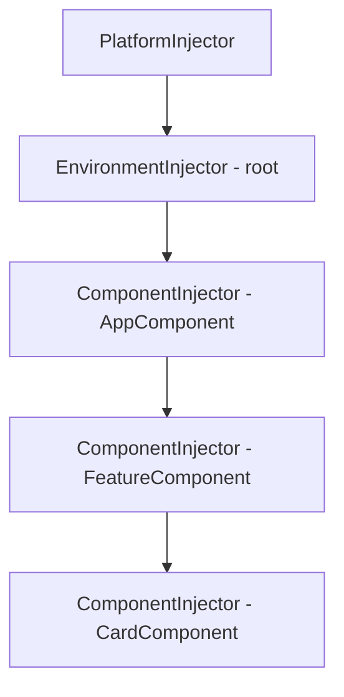

# Angular Dependency Injection

## Introduction

Dependency Injection (DI) is a design pattern where a class receives its dependencies from an external source rather than creating them itself. Angular has a built-in, hierarchical DI system that provides services, configuration, and other objects to components and services throughout the application.

DI is what makes Angular applications testable and modular. Swap a real HTTP service for a mock in tests with a single line. Scope a service to a specific feature module. Provide different implementations per environment.

---

## Why it matters

- Every Angular component, service, pipe, and guard participates in DI
- Understanding the injector hierarchy explains why two components might get different service instances
- Injection tokens and factory providers unlock advanced patterns used in enterprise apps
- The `inject()` function is the modern API for DI — replacing constructor injection in most cases

---

## Basic Usage

```typescript
// 1. Define a service
@Injectable({ providedIn: 'root' })
export class UserService {
  private readonly http = inject(HttpClient);

  getUser(id: string): Observable<User> {
    return this.http.get<User>(`/api/users/${id}`);
  }
}

// 2. Inject it into a component
@Component({ standalone: true })
export class ProfileComponent {
  private readonly userService = inject(UserService);

  readonly user = toSignal(
    inject(ActivatedRoute).paramMap.pipe(
      map(p => p.get('id')!),
      switchMap(id => this.userService.getUser(id))
    ),
    { initialValue: null }
  );
}
```

---

## The Injector Hierarchy

Angular maintains a tree of injectors that mirrors the application structure:



When a component requests a token, Angular walks **up** the tree until it finds a provider:

```
CardComponent injector
  → FeatureComponent injector
    → AppComponent injector
      → Root EnvironmentInjector
        → PlatformInjector
          → null (NullInjector throws error)
```

---

## Provider Scope — Where Services Live

```typescript
// Root — singleton, shared across the entire app
@Injectable({ providedIn: 'root' })
export class GlobalAuthService {}

// Platform — shared across multiple apps on one page (micro-frontends)
@Injectable({ providedIn: 'platform' })
export class SharedConfigService {}

// Component scope — new instance per component subtree
@Component({
  providers: [FormWizardStateService], // destroyed with this component
})
export class CheckoutWizardComponent {}

// Route-level scope (Angular 17+)
const routes: Routes = [{
  path: 'checkout',
  component: CheckoutComponent,
  providers: [CheckoutService], // scoped to this route
}];
```

**When to use component scoping:** Feature-specific state like a multi-step form, a shopping cart modal, or a canvas editor — services that should be reset when the feature unmounts.

---

## Injection Tokens

For values that aren't class instances — config, feature flags, environment variables:

```typescript
import { InjectionToken, inject } from '@angular/core';

// Define the token with its type
export const API_BASE_URL = new InjectionToken<string>('API_BASE_URL');
export const FEATURE_FLAGS = new InjectionToken<FeatureFlags>('FEATURE_FLAGS');
export const MAX_UPLOAD_SIZE = new InjectionToken<number>('MAX_UPLOAD_SIZE');

// Provide at bootstrap
bootstrapApplication(AppComponent, {
  providers: [
    { provide: API_BASE_URL, useValue: 'https://api.example.com' },
    {
      provide: FEATURE_FLAGS,
      useFactory: () => ({
        newDashboard: environment.production,
        betaSearch: false,
      }),
    },
    { provide: MAX_UPLOAD_SIZE, useValue: 50 * 1024 * 1024 }, // 50MB
  ],
});

// Inject anywhere
@Injectable({ providedIn: 'root' })
export class ApiService {
  private readonly baseUrl = inject(API_BASE_URL);
  private readonly flags = inject(FEATURE_FLAGS);

  getEndpoint(path: string): string {
    return `${this.baseUrl}${path}`;
  }
}
```

---

## `inject()` Function

The `inject()` function works in any injection context — property initializers, constructors, factory functions:

```typescript
@Component({ standalone: true })
export class DashboardComponent {
  // Works as property initializers — no constructor needed
  private readonly userService = inject(UserService);
  private readonly router = inject(Router);
  private readonly destroyRef = inject(DestroyRef);
  private readonly route = inject(ActivatedRoute);

  // Inject with optional flag — returns null if not found
  private readonly analyticsService = inject(AnalyticsService, { optional: true });

  // Inject from parent injector only (skip self)
  private readonly parentTheme = inject(ThemeService, { skipSelf: true });
}
```

### `inject()` outside a class

```typescript
// Reusable composition functions (like React hooks)
function useCurrentUser() {
  const authService = inject(AuthService);
  return toSignal(authService.currentUser$, { initialValue: null });
}

@Component({ standalone: true })
export class NavbarComponent {
  currentUser = useCurrentUser(); // clean, composable
}
```

---

## Multi-Providers

Provide multiple values for the same token — used for plugin systems and extension points:

```typescript
export const VALIDATORS = new InjectionToken<Validator[]>('VALIDATORS');

// Each provider adds to the array
providers: [
  { provide: VALIDATORS, useClass: RequiredValidator, multi: true },
  { provide: VALIDATORS, useClass: EmailValidator, multi: true },
  { provide: VALIDATORS, useClass: MinLengthValidator, multi: true },
]

// Inject all validators
@Injectable()
export class FormService {
  private readonly validators = inject(VALIDATORS); // Validator[]
}
```

---

## Testing with DI

```typescript
describe('ProfileComponent', () => {
  it('loads user on init', async () => {
    const mockUser: User = { id: '1', name: 'Alice' };
    const mockUserService = { getUser: () => of(mockUser) };

    TestBed.configureTestingModule({
      imports: [ProfileComponent],
      providers: [
        { provide: UserService, useValue: mockUserService },
        { provide: ActivatedRoute, useValue: { paramMap: of(new Map([['id', '1']])) } },
      ],
    });

    const fixture = TestBed.createComponent(ProfileComponent);
    fixture.detectChanges();

    expect(fixture.componentInstance.user()).toEqual(mockUser);
  });
});
```

---

## Interview Questions

**Q (Easy): What is `providedIn: 'root'` and why is it the default?**

It registers the service in the root environment injector, creating a singleton shared across the entire application. It's tree-shakable — if nothing injects the service, it's excluded from the bundle. This is more efficient than providing in an NgModule because the service is only included when used.

**Q (Medium): How does component-level DI enable scoped state?**

When you add a service to a component's `providers` array, Angular creates a new injector node for that component's subtree. Every component in that subtree that injects the service gets the same scoped instance — separate from any root-level instance. When the component is destroyed, Angular destroys the scoped injector and the service instance with it. This is ideal for feature-specific state that should reset when the feature closes.

**Q (Hard): What is the difference between `useValue`, `useClass`, `useFactory`, and `useExisting`?**

- `useValue` — provides a static value. Good for config, tokens, primitives.
- `useClass` — Angular instantiates the class and injects its dependencies. Good for swapping implementations (mock vs real).
- `useFactory` — calls a function to produce the value. Good for dynamic config based on environment or other injected values.
- `useExisting` — creates an alias — requests for token A resolve to the same instance as token B. Good for providing an interface type that maps to a concrete class already in the tree.

**Q (Senior): How would you implement a plugin architecture using Angular DI?**

Define an abstract base class or interface as an injection token. Use `multi: true` providers so each plugin registers itself. The host system injects the token as an array and calls each plugin in sequence. Plugins can be provided at the root level (available everywhere) or at the feature level (scoped to a specific route). This pattern is used by Angular's router (route matchers), forms (validators), and HTTP (interceptors).

---

## Cheat Sheet

```typescript
// Root singleton
@Injectable({ providedIn: 'root' })

// Inject
private svc = inject(MyService);
private val = inject(MY_TOKEN);
private optional = inject(MyService, { optional: true });
private parent = inject(MyService, { skipSelf: true });

// Token
const TOKEN = new InjectionToken<Type>('description');

// Providers
{ provide: TOKEN, useValue: value }
{ provide: TOKEN, useClass: MyClass }
{ provide: TOKEN, useFactory: () => makeValue() }
{ provide: TOKEN, useExisting: OtherToken }
{ provide: TOKEN, useClass: MyClass, multi: true } // array

// Scope
providedIn: 'root'      // global singleton
providedIn: 'platform'  // cross-app singleton
providers: [Svc]        // in @Component or route config → scoped
```

---

## Related Topics

- **Previous:** [Services](./services)
- **Next:** [Modules](./modules)
- **Related:** [Angular Signals](./signals)
- **Related:** [Angular Testing](/docs/angular/best-practices)
