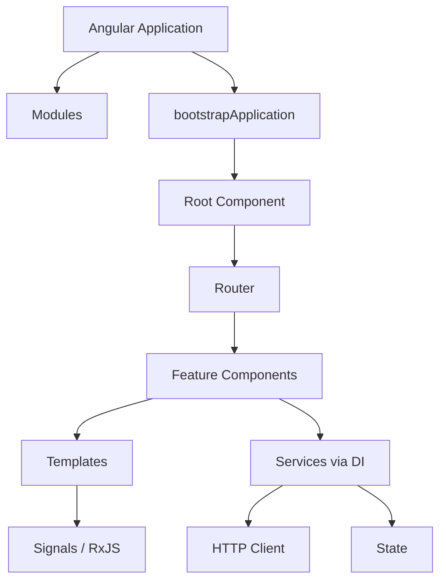
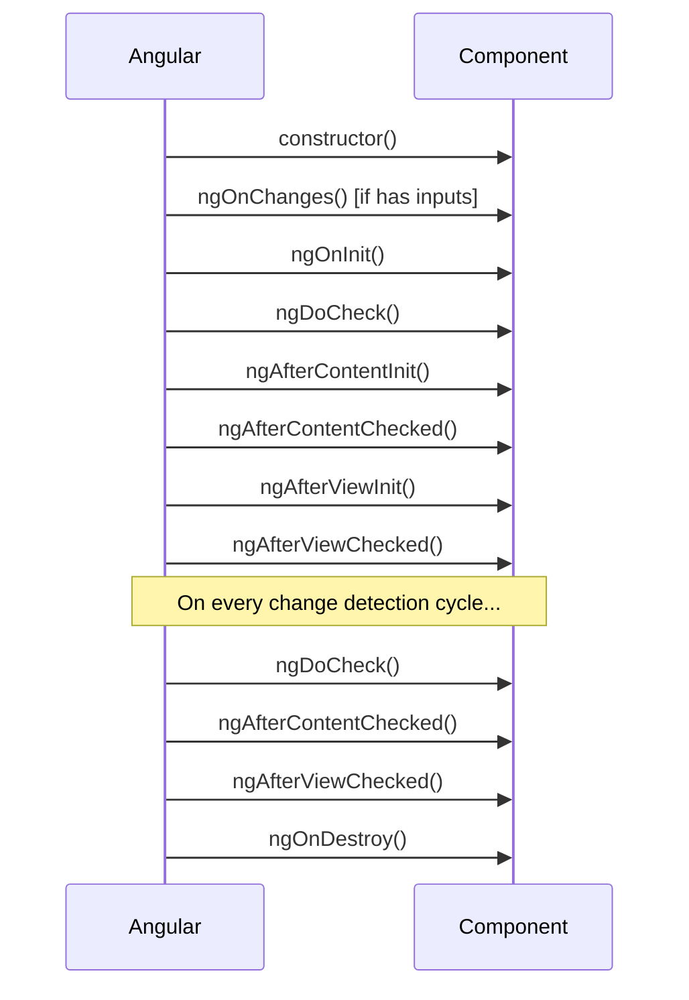

# Angular Introduction

## Introduction

Angular is a platform and framework for building single-page applications using HTML, CSS, and TypeScript. It is developed and maintained by Google, used by some of the world's largest companies, and is the dominant frontend framework in enterprise environments.

Angular is opinionated by design. It provides a complete solution: a component model, a router, a form library, HTTP client, dependency injection, and testing utilities — all integrated and versioned together.

---

## Why it matters

Angular's opinionated architecture solves the two hardest problems in large frontend applications:

1. **Scale** — consistent patterns across teams of 10 or 1000 developers
2. **Maintainability** — TypeScript-first, strong typing, and Angular's compiler catch bugs at build time

Companies like JPMorgan, Microsoft, Deutsche Bank, and PayPal run massive Angular applications because the framework's consistency and tooling pay off at scale.

---

## Angular Architecture



---

## Core Building Blocks

### Components

The basic building block. A component combines an HTML template, CSS styles, and a TypeScript class:

```typescript
@Component({
  selector: 'app-user-card',
  standalone: true,
  imports: [NgIf, NgFor],
  template: `
    <article class="card">
      <h2>{{ user().name }}</h2>
      <p>{{ user().role }}</p>
    </article>
  `,
  styles: [`
    .card { padding: 1rem; border-radius: 8px; }
  `],
})
export class UserCardComponent {
  user = input.required<User>();
}
```

### Templates

Angular templates are HTML supercharged with:
- Interpolation: `{{ expression }}`
- Property binding: `[property]="expression"`
- Event binding: `(event)="handler()"`
- Two-way binding: `[(ngModel)]="value"`
- Control flow: `@if`, `@for`, `@switch`

### Services and Dependency Injection

Services hold business logic. DI provides them to components:

```typescript
@Injectable({ providedIn: 'root' })
export class UserService {
  private readonly http = inject(HttpClient);

  getUsers(): Observable<User[]> {
    return this.http.get<User[]>('/api/users');
  }
}
```

### The Dependency Injection Tree

Angular's DI system is hierarchical. Providers can be scoped to:
- `root` — singleton, shared across the entire app
- `platform` — shared across multiple apps in one page
- A specific component — new instance per component subtree

---

## Modern Angular (v17+)

Angular has evolved significantly:

| Old | New |
|---|---|
| `*ngIf` | `@if` (control flow) |
| `*ngFor` | `@for` (with required `track`) |
| NgModules | Standalone components |
| RxJS-based state | Signals |
| Zone.js CD | Signal-based CD (in progress) |
| `ngcc` | ESM-first compilation |

---

## Angular vs React vs Vue

| Feature | Angular | React | Vue |
|---|---|---|---|
| Language | TypeScript-first | JSX/TSX | SFC (HTML+JS) |
| Architecture | Full framework | UI library | Progressive framework |
| State | Signals, RxJS | Context, Zustand, Redux | Pinia, Vuex |
| DI | Built-in hierarchical | Not built-in | Not built-in |
| Testing | Jasmine/Jest (built-in) | Jest (external) | Vitest (external) |
| Enterprise use | Very strong | Strong | Moderate |
| Bundle size | Larger (framework) | Smaller (library) | Smaller |

**Choose Angular when:** you need enforced consistency across a large team, strong TypeScript integration, or an all-in-one solution.

---

## Angular Lifecycle



---

## Performance Notes

- Angular's Ivy compiler produces optimized JavaScript per component
- `@defer` blocks enable route-level and component-level lazy loading
- Standalone components improve tree-shaking
- OnPush change detection strategy reduces unnecessary renders
- Signals eliminate zone-based change detection overhead

---

## Accessibility Notes

- Angular Material follows WAI-ARIA guidelines
- Use Angular CDK's `a11y` module for focus management, live announcements
- Route transitions should announce page title changes to screen readers

---

## Common Mistakes

| Mistake | Problem | Fix |
|---|---|---|
| Logic in templates | Hard to test, poor performance | Move to component class or service |
| Not unsubscribing observables | Memory leaks | Use `takeUntilDestroyed()` or `async` pipe |
| Using `any` type | Defeats TypeScript | Define proper types/interfaces |
| Not using `trackBy` (now `track`) | Poor list rendering performance | Always use `track` in `@for` |
| Global styles in component stylesheets | Style leaks | Use CSS custom properties or Angular Material theming |

---

## Interview Questions

**Q (Easy): What is the difference between a component and a directive?**

A component has a template — it creates an element in the DOM with a view. A directive doesn't create elements; it adds behavior or modifies existing elements. `NgClass`, `NgStyle`, and custom directives like `[tooltip]` are directives. Every component is technically a directive with a template.

**Q (Medium): What is the Angular compilation model and why does Ivy matter?**

The Ivy compiler (Angular's current compiler since v9) compiles each component independently into self-contained JavaScript. Before Ivy, the ViewEngine required global compilation, making incremental builds slow. Ivy generates a `ɵcmp` factory per component that contains everything Angular needs to create and change-detect that component. This enables smaller bundles via better tree-shaking and faster compilation.

**Q (Hard): How does Angular's hierarchical dependency injection work?**

Angular maintains a tree of injectors that mirrors the component tree. When a component requests a token, Angular walks up the injector tree until it finds a provider. A `providedIn: 'root'` service lives in the root injector. A service provided in a component's `providers` array creates a new instance for that component subtree. This enables scoped state: a modal component can have its own service instance that's destroyed when the modal closes.

---

## 30-Second Answer

Angular is a complete framework built around components, templates, services, and dependency injection. A component encapsulates a view (template + styles) and logic (class). Services provide shared logic via DI. Modern Angular uses standalone components, signals for state, and `@if/@for` control flow. It excels in large enterprise applications where consistency and TypeScript integration are critical.

---

## Exercises

1. Create a standalone Angular app (no AppModule) that displays a list of users fetched from a public API, using signals for state.
2. Implement a custom structural directive and explain how it differs from a component.
3. Profile an Angular app's initial load in Chrome DevTools and identify which Angular initialization tasks take the most time.

---

## Cheat Sheet

```
Setup:
  npm install -g @angular/cli
  ng new my-app --standalone --routing
  ng serve

Generate:
  ng generate component feature/my-comp
  ng generate service core/my-service

Component anatomy:
  @Component({ selector, standalone, imports, template, styles })
  class MyComp {
    // Input signals
    name = input<string>();
    name = input.required<string>();
    
    // Output events
    clicked = output<void>();
    
    // Injected services
    service = inject(MyService);
  }

Template syntax:
  {{ expr }}             interpolation
  [prop]="expr"          property binding
  (event)="handler()"   event binding
  [(ngModel)]="val"      two-way binding
  @if (cond) { }         conditional
  @for (item of list; track item.id) { }  loop
```

---

## Summary

Angular is the enterprise frontend framework. Its component model, DI system, and TypeScript-first approach enable large teams to build maintainable applications at scale. Modern Angular (v17+) has moved to standalone components, control flow blocks, and signals — making applications faster and code cleaner.

---

## Official References

- [Angular Documentation](https://angular.dev)
- [Angular GitHub](https://github.com/angular/angular)
- [Angular Blog](https://blog.angular.dev)

---

## Related Topics

- **Next:** [Angular Components](/docs/angular/components)
- **Related:** [TypeScript Introduction](/docs/typescript/introduction)
- **Related:** [RxJS Introduction](/docs/rxjs/introduction)
- **Prerequisites:** [TypeScript Introduction](/docs/typescript/introduction), [HTML Introduction](/docs/html/introduction)
