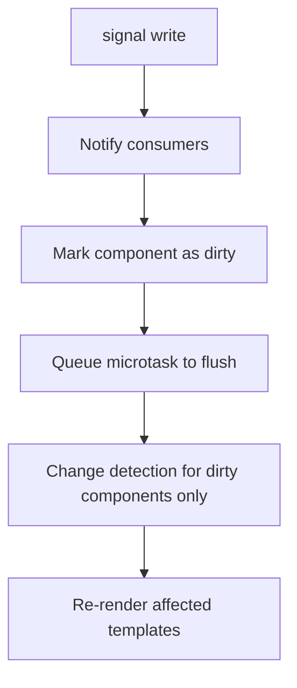

# Angular Signals

## Introduction

Angular Signals, introduced as stable in Angular 17, are reactive primitives that allow Angular to track state changes with surgical precision. Instead of Zone.js intercepting every async operation and running change detection for the entire tree, signals create an explicit dependency graph — only components that consume a signal are updated when it changes.

---

## Why it matters

Signals solve three longstanding Angular pain points:

1. **Performance** — no more unnecessary change detection cycles
2. **Explicitness** — reactive dependencies are visible in the code
3. **Zone.js removal** — signals enable Angular to eventually run without Zone.js

If you're in an interview for a Senior Angular role, Signals is the most important topic to master in 2025.

---

## Signal Primitives

### `signal()` — Writable State

```typescript
import { signal } from '@angular/core';

// Create a writable signal
const count = signal(0);

// Read the value
console.log(count()); // 0

// Write a new value
count.set(1);

// Update based on current value
count.update(v => v + 1);

// Mutate in place (for objects/arrays)
const items = signal<string[]>([]);
items.mutate(arr => arr.push('new item'));
```

### `computed()` — Derived State

Computed signals derive their value from other signals. They are **lazy** (only recalculate when read) and **memoized** (cache the result until dependencies change):

```typescript
import { signal, computed } from '@angular/core';

const firstName = signal('Alice');
const lastName = signal('Smith');

const fullName = computed(() => `${firstName()} ${lastName()}`);

console.log(fullName()); // 'Alice Smith'
firstName.set('Bob');
console.log(fullName()); // 'Bob Smith' — automatically updated
```

### `effect()` — Side Effects

Effects run when signals they read change. Use for synchronizing state to external systems (logging, localStorage, canvas):

```typescript
import { signal, effect } from '@angular/core';

const theme = signal<'light' | 'dark'>('dark');

// Runs immediately and whenever theme changes
effect(() => {
  document.body.setAttribute('data-theme', theme());
});
```

---

## Signals in Components

```typescript
@Component({
  selector: 'app-counter',
  standalone: true,
  template: `
    <div class="counter">
      <button (click)="decrement()">−</button>
      <span>{{ count() }}</span>
      <button (click)="increment()">+</button>
    </div>
    <p>Double: {{ doubleCount() }}</p>
  `,
})
export class CounterComponent {
  count = signal(0);
  doubleCount = computed(() => this.count() * 2);

  increment() { this.count.update(v => v + 1); }
  decrement() { this.count.update(v => v - 1); }
}
```

Angular tracks signal reads during template rendering. When `count` changes, only the template expressions that read `count()` are re-evaluated.

---

## Input Signals

Angular 17.1+ provides input signals via `input()`:

```typescript
@Component({
  selector: 'app-user-badge',
  standalone: true,
  template: `
    <span class="badge badge--{{ role() }}">{{ name() }}</span>
  `,
})
export class UserBadgeComponent {
  // Required input — component won't compile without it
  name = input.required<string>();

  // Optional input with default
  role = input<'admin' | 'user'>('user');

  // Input with transform (converts string to number)
  size = input(16, { transform: (v: string | number) => Number(v) });
}
```

---

## Output Signals

```typescript
@Component({
  selector: 'app-form',
  standalone: true,
  template: `
    <button (click)="submit()">Submit</button>
  `,
})
export class FormComponent {
  formSubmitted = output<FormData>();

  submit() {
    this.formSubmitted.emit(this.buildFormData());
  }
}
```

---

## RxJS Interoperability

### `toSignal()` — Observable to Signal

```typescript
import { toSignal } from '@angular/core/rxjs-interop';

@Component({
  selector: 'app-users',
  standalone: true,
  template: `
    @if (users()) {
      @for (user of users()!; track user.id) {
        <div>{{ user.name }}</div>
      }
    }
  `,
})
export class UsersComponent {
  private readonly userService = inject(UserService);

  // Convert observable to signal — subscribes and unsubscribes automatically
  users = toSignal(this.userService.getUsers(), { initialValue: null });
}
```

### `toObservable()` — Signal to Observable

```typescript
import { toObservable } from '@angular/core/rxjs-interop';

@Injectable({ providedIn: 'root' })
export class SearchService {
  query = signal('');

  // Convert to observable to use RxJS operators
  results$ = toObservable(this.query).pipe(
    debounceTime(300),
    distinctUntilChanged(),
    switchMap(q => this.http.get<Result[]>(`/api/search?q=${q}`))
  );
}
```

---

## Signal-based State Management

```typescript
@Injectable({ providedIn: 'root' })
export class CartStore {
  private readonly _items = signal<CartItem[]>([]);

  // Read-only public signal
  readonly items = this._items.asReadonly();

  readonly total = computed(() =>
    this._items().reduce((sum, item) => sum + item.price * item.quantity, 0)
  );

  readonly itemCount = computed(() =>
    this._items().reduce((sum, item) => sum + item.quantity, 0)
  );

  addItem(item: CartItem): void {
    this._items.update(items => {
      const existing = items.find(i => i.id === item.id);
      if (existing) {
        return items.map(i =>
          i.id === item.id ? { ...i, quantity: i.quantity + 1 } : i
        );
      }
      return [...items, { ...item, quantity: 1 }];
    });
  }

  removeItem(id: string): void {
    this._items.update(items => items.filter(i => i.id !== id));
  }
}
```

---

## How Signals Work Internally



Each signal maintains a set of consumers (computed signals and template expressions). When a signal is written, it marks its consumers as stale. Angular schedules a flush via `queueMicrotask()` and re-renders only the components with stale consumers.

---

## Performance Notes

- Computed signals are lazy — they only recalculate when read after a dependency changes
- Reading a signal during change detection creates a dependency — don't call side effects in template expressions
- `effect()` runs synchronously in the reactive context — keep effects lightweight
- Prefer `computed()` over `effect()` for derived state

---

## Common Mistakes

| Mistake | Problem | Fix |
|---|---|---|
| Mutating signal values without `.set()` | Angular doesn't detect the change | Always use `set()`, `update()`, or `mutate()` |
| Using `effect()` for derived data | Use `computed()` instead | Reserve `effect()` for DOM sync, logging |
| Reading a signal outside reactive context | No reactivity tracking | Read inside template, computed, or effect |
| Creating signals in constructors before DI | Injection context not available | Use `inject()` for services, create signals as class fields |

---

## Interview Questions

**Q (Easy): What is the difference between `signal()` and `computed()`?**

`signal()` is writable state — you can call `.set()`, `.update()`, or `.mutate()` on it. `computed()` derives a value from other signals and is read-only. Computed values are automatically recalculated when their signal dependencies change.

**Q (Medium): How do signals improve Angular's change detection performance compared to Zone.js?**

Zone.js intercepts all async operations and triggers a full change detection cycle from the root component down. Signals create an explicit reactive graph where Angular knows exactly which components read which signals. When a signal changes, only the components in its dependency graph are marked dirty and re-rendered. This eliminates unnecessary change detection cycles in components that didn't read that signal.

**Q (Hard): What is the difference between `toSignal()` and manually subscribing to an observable?**

`toSignal()` creates a signal from an observable and handles subscription/unsubscription automatically within the component's injection context. It requires an active injection context (component constructor, `inject()` calls). The signal is initialized with `initialValue` or `undefined` until the first emission. Unlike manual subscriptions, `toSignal()` unsubscribes automatically when the component is destroyed and integrates with Angular's reactive graph, so templates don't need the `async` pipe.

**Q (Senior): How would you design a signal-based state store for a large Angular enterprise application?**

The pattern mirrors a Redux-like store but with signals instead of observables. Create an injectable service with private writable signals and public readonly signals. Expose computed signals for derived state (totals, filtered lists). Provide mutation methods as the public API. For async operations, use `toSignal()` from observables returned by services, or manage loading/error state as additional signals. For large apps, split into feature stores with the root store providing only application-level state. The signal graph naturally handles recomputation, avoiding manual subscription management.

---

## 30-Second Answer

Angular Signals are reactive primitives. A `signal()` holds writable state, `computed()` derives state reactively, and `effect()` runs side effects. When a signal changes, Angular updates only the components that read it — not the entire tree. `toSignal()` converts observables to signals and `toObservable()` converts back. Signals are the foundation of Angular's future without Zone.js.

---

## Cheat Sheet

```typescript
// Create
const count = signal(0);
const name = signal<string>('');
const items = signal<Item[]>([]);

// Write
count.set(5);
count.update(v => v + 1);
items.mutate(arr => arr.push(item));

// Read (in template or reactive context)
count()
name()

// Derived state
const doubled = computed(() => count() * 2);

// Side effects
effect(() => localStorage.setItem('count', String(count())));

// Component inputs
name = input<string>();
name = input.required<string>();

// Component outputs
changed = output<string>();

// RxJS bridge
const users = toSignal(users$, { initialValue: [] });
const query$ = toObservable(querySignal);
```

---

## Summary

Signals represent the biggest change to Angular's reactivity model since the framework's creation. They provide fine-grained reactivity, explicit dependencies, and a path to removing Zone.js. For state management, signals replace most use cases of BehaviorSubject. For async data, `toSignal()` replaces the `async` pipe. Understanding signals is mandatory for Angular development in 2025 and beyond.

---

## Official References

- [Angular Signals Guide](https://angular.dev/guide/signals)
- [Signal Inputs](https://angular.dev/guide/signals/inputs)
- [RxJS Interop](https://angular.dev/guide/signals/rxjs-interop)

---

## Related Topics

- **Previous:** [Angular Introduction](./introduction)
- **Next:** [Change Detection](./change-detection)
- **Related:** [RxJS Observables](/docs/rxjs/observables)
- **Prerequisites:** [Angular Introduction](./introduction), [RxJS Introduction](/docs/rxjs/introduction)
