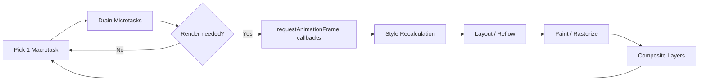

# Browser Event Loop

> **Prerequisite:** This page covers browser-specific rendering behavior. For the full explanation of call stack, microtask/macrotask queues, and Angular Zone.js, see [JavaScript Event Loop](/docs/javascript/event-loop).

---

## The Browser Frame Loop

The browser does more than run JavaScript — it also handles style recalculation, layout, paint, and compositing. These rendering steps are integrated into the event loop:



---

## Frame Budget: The 16ms Rule

At 60fps, the browser has **16.67ms per frame**. The entire cycle — JS execution, style, layout, paint — must fit within this budget.

```
16ms budget breakdown (typical):
  JS execution:      ~10ms
  Style + Layout:    ~3ms
  Paint + Composite: ~3ms
```

Any JavaScript that runs for more than 50ms is a **long task** and will cause a noticeable jank (frame drop).

---

## requestAnimationFrame

`rAF` callbacks run after microtasks but before style/layout — making them the correct place for visual updates:

```javascript
let x = 0;

function animate() {
  // Runs before the frame is painted — guaranteed smooth
  element.style.transform = `translateX(${x}px)`;
  x += 2;

  if (x < 300) {
    requestAnimationFrame(animate); // schedule next frame
  }
}

requestAnimationFrame(animate);
```

**Do not use `setInterval` for animations.** `setInterval` fires on macrotask timing, which is decoupled from frame rendering — causing visual tearing and wasted frames.

---

## Layout Thrashing

Reading a layout property (e.g., `offsetWidth`, `getBoundingClientRect`) forces the browser to flush any pending style/layout work synchronously — this is called a **forced synchronous layout** and kills performance:

```javascript
// ❌ Thrashing — forces 10 synchronous layouts
elements.forEach(el => {
  const width = el.offsetWidth;       // forces layout
  el.style.width = (width + 10) + 'px'; // invalidates layout
});

// ✅ Batch reads, then batch writes
const widths = elements.map(el => el.offsetWidth); // one layout
widths.forEach((w, i) => {
  elements[i].style.width = (w + 10) + 'px';       // one invalidation
});
```

Angular's renderer and signal-based DOM updates batch writes automatically. Manual DOM manipulation (third-party libraries, direct DOM access in lifecycle hooks) is where thrashing typically appears.

---

## Long Tasks and Main Thread Blocking

Tasks longer than 50ms block rendering. Strategies to break them up:

```javascript
// ❌ Blocks for ~500ms — no frames painted during this time
function heavyWork() {
  for (let i = 0; i < 10_000_000; i++) {
    processItem(i);
  }
}

// ✅ Yield to browser between chunks
async function heavyWorkYielding(items: unknown[]) {
  const CHUNK = 1000;
  for (let i = 0; i < items.length; i += CHUNK) {
    processChunk(items.slice(i, i + CHUNK));
    await new Promise(r => setTimeout(r, 0)); // yield one macrotask
  }
}

// ✅ Modern API (Chrome 115+)
async function heavyWorkScheduler(items: unknown[]) {
  const CHUNK = 1000;
  for (let i = 0; i < items.length; i += CHUNK) {
    processChunk(items.slice(i, i + CHUNK));
    await scheduler.yield(); // yields to browser, preserves user intent priority
  }
}
```

---

## Intersection Observer and ResizeObserver

These APIs deliver callbacks as microtasks after layout, before paint — making them more efficient than `scroll` event listeners polling `getBoundingClientRect`:

```javascript
const io = new IntersectionObserver(entries => {
  entries.forEach(entry => {
    if (entry.isIntersecting) {
      loadImage(entry.target); // triggered after layout, no forced reflow
    }
  });
}, { threshold: 0.1 });

io.observe(document.querySelector('.lazy-image'));
```

---

## Rendering Pipeline Summary

| Phase | What happens | Triggered by |
|---|---|---|
| JavaScript | Event handlers, timers, promises | Task/microtask queues |
| Style | Match CSS rules to DOM nodes | DOM/CSSOM changes |
| Layout (Reflow) | Calculate positions and sizes | Size/position changes |
| Paint | Draw pixels into layers | Visual changes |
| Composite | GPU layers combined on screen | Transform/opacity changes (cheap) |

**Cheapest changes** (compositor-only, no layout/paint): `transform`, `opacity`  
**Most expensive** (trigger full pipeline): `width`, `height`, `top`, `left`, `font-size`

---

## Interview Questions

**Q: Why does `setTimeout(fn, 0)` not run immediately?**

`setTimeout` queues a macrotask. The current macrotask must complete, all microtasks must drain, and the browser may render before the timer callback runs — even with a 0ms delay. In practice, browsers enforce a minimum of ~4ms between nested `setTimeout` calls.

**Q: What is requestAnimationFrame and when should you use it?**

`rAF` schedules a callback to run before the browser's next paint, synchronized with the display refresh rate. Use it for any visual update — CSS property changes, canvas drawing, scroll-linked effects. Avoid `setInterval` for animation because it's not synchronized with frame rendering.

**Q: What causes layout thrashing and how do you prevent it?**

Layout thrashing occurs when code alternates between reading layout properties (`offsetWidth`, `getBoundingClientRect`) and writing style properties in a loop. Each read after a write forces the browser to synchronously recalculate layout. Fix by batching all reads first, then all writes — or use `requestAnimationFrame` to ensure writes happen before the next frame.

---

## 30-Second Answer

The browser event loop processes one macrotask, drains all microtasks, then renders (every ~16ms for 60fps). `requestAnimationFrame` runs just before paint, making it the correct place for visual updates. Long tasks (>50ms) block frames — break them into chunks with `await scheduler.yield()` or `setTimeout`. Layout thrashing — alternating DOM reads and writes — forces synchronous reflow; always batch reads then writes.

---

## Related Topics

- **Previous:** [Rendering Pipeline](./rendering-pipeline)
- **Next:** [Memory Management](./memory-management)
- **Related:** [JavaScript Event Loop](/docs/javascript/event-loop) — primary reference for call stack, microtasks, and Zone.js
- **Related:** [Performance — Core Web Vitals](/docs/performance/core-web-vitals)
- **Related:** [Angular Change Detection](/docs/angular/change-detection)
