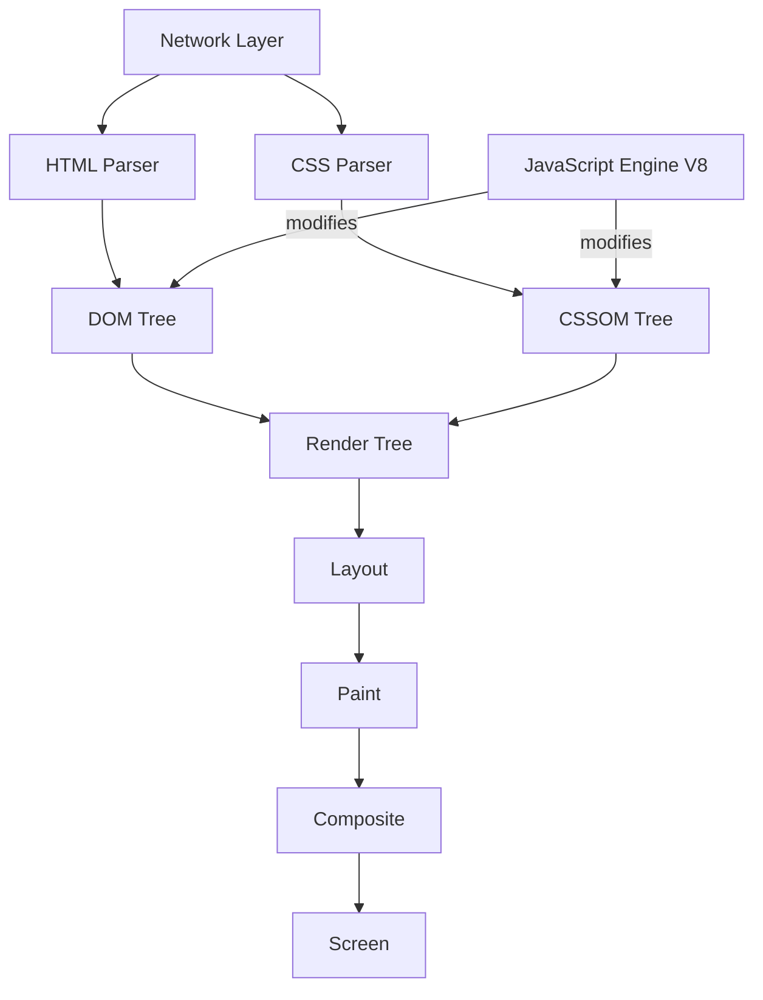

# Browser Internals

## Introduction

A browser is a complex runtime that parses HTML, runs JavaScript, applies CSS, manages memory, handles security, and paints 60 frames per second. Understanding its internals makes you a better Angular developer — you'll know why `requestAnimationFrame` is smoother than `setTimeout`, why layout thrashing kills performance, and how the browser applies Angular's generated styles.

---

## Why it matters

Senior frontend engineers are expected to:
- Diagnose why a page is slow using the browser's rendering pipeline
- Understand why Zone.js works (it patches browser APIs)
- Explain why reading `offsetWidth` after a DOM mutation forces a synchronous layout
- Know how browsers apply CSP to protect against XSS

---

## Key Browser Components

---

## The Rendering Pipeline

1. **Parse** — HTML → DOM, CSS → CSSOM
2. **Style** — Combine DOM + CSSOM → computed styles per node
3. **Layout** — Calculate position and size of every element
4. **Paint** — Fill pixels into layers
5. **Composite** — Assemble layers and send to GPU

Angular's change detection produces DOM mutations. Those mutations trigger parts of this pipeline. The more you mutate, the more pipeline work the browser does.

---

## What to Study Next

| Chapter | Why it matters |
|---|---|
| [Rendering Pipeline](./rendering-pipeline) | Understand Layout, Paint, Composite — optimize Angular |
| [Event Loop](./event-loop) | Zone.js hooks, scheduling, rendering timing |
| [Memory Management](./memory-management) | Detect and fix Angular memory leaks |
| [Storage](./storage) | localStorage, sessionStorage, IndexedDB, cookies |
| [Security](./security) | CSP, XSS, CSRF — enterprise Angular requirements |

---

## Official References

- [Chrome DevTools Documentation](https://developer.chrome.com/docs/devtools/)
- [How Browsers Work — web.dev](https://web.dev/articles/howbrowserswork)
- [Inside V8](https://v8.dev/blog)

---

## Related Topics

- **Related:** [JavaScript Event Loop](/docs/javascript/event-loop)
- **Related:** [Performance Introduction](/docs/performance/introduction)
