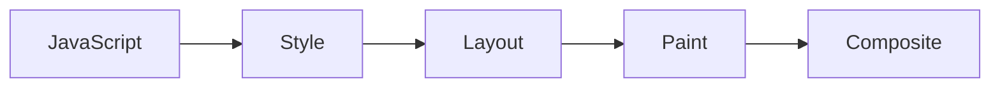

# Browser Rendering Pipeline

## The Six Stages



### 1. Parse
- HTML → DOM tree
- CSS → CSSOM tree

### 2. Style (Recalculate)
- Combine DOM + CSSOM
- Compute every element's final styles

### 3. Layout (Reflow)
- Calculate position and dimensions for every element
- Most expensive — any size/position change triggers this

### 4. Paint
- Fill pixels into layers
- Creates bitmaps for each layer

### 5. Composite
- Assemble layers in correct order
- GPU renders to screen

---

## What Angular DOM Changes Trigger

| Change Type | Pipeline Stages |
|---|---|
| `transform`, `opacity` change | Composite only |
| `background`, `color` change | Paint → Composite |
| `width`, `height`, `margin`, `padding` change | Layout → Paint → Composite |
| Adding/removing DOM elements | Layout → Paint → Composite |

Angular signals trigger minimal DOM mutations. Zone.js change detection can trigger many.

---

## Layout Thrashing

Reading layout properties (after writing) forces synchronous layout:

```javascript
// Bad — layout thrashing
elements.forEach(el => {
  const width = el.offsetWidth; // forces layout
  el.style.width = width + 10 + 'px'; // write
  // next iteration reads again — forces layout again
});

// Good — batch reads then writes
const widths = elements.map(el => el.offsetWidth); // batch reads
elements.forEach((el, i) => {
  el.style.width = widths[i] + 10 + 'px'; // batch writes
});
```

Properties that force synchronous layout: `offsetWidth/Height/Top/Left`, `scrollTop/Left`, `clientWidth/Height`, `getBoundingClientRect()`.

---

## Related Topics

- **Previous:** [Browser Introduction](./introduction)
- **Next:** [Event Loop](./event-loop)
- **Related:** [CSS Performance](/docs/css/performance)
