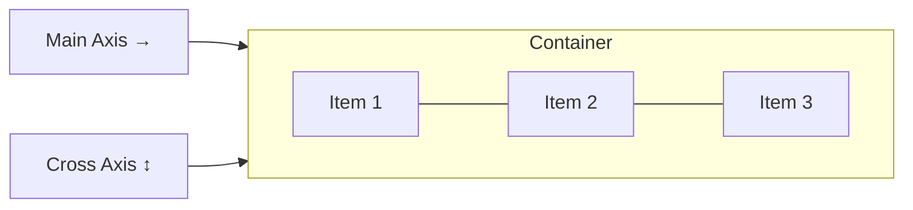

# CSS Flexbox

## Introduction

Flexbox (Flexible Box Layout) is a one-dimensional layout model designed for distributing space and aligning items along a single axis — either a row or a column. It excels at component-level layouts: navigation bars, card rows, button groups, and form controls.

---

## Why it matters

Before Flexbox, centering an element vertically required hacks: absolute positioning with negative margins, table-cell display tricks, or line-height manipulation. Flexbox made these trivial and made a vast class of layout problems declarative.

---

## The Two Axes



- **Main axis** — defined by `flex-direction` (default: horizontal left-to-right)
- **Cross axis** — perpendicular to the main axis

---

## Container Properties

```css
.container {
  display: flex;                        /* or inline-flex */
  flex-direction: row;                  /* row | row-reverse | column | column-reverse */
  flex-wrap: nowrap;                    /* nowrap | wrap | wrap-reverse */
  justify-content: flex-start;         /* alignment on main axis */
  align-items: stretch;                /* alignment on cross axis */
  align-content: normal;               /* multi-line cross axis alignment */
  gap: 1rem;                           /* gap between items */
  row-gap: 1rem;
  column-gap: 0.5rem;
}
```

### `justify-content` values

| Value | Behavior |
|---|---|
| `flex-start` | Pack to start of main axis |
| `flex-end` | Pack to end of main axis |
| `center` | Center on main axis |
| `space-between` | Even gaps, no outer gaps |
| `space-around` | Even gaps, half-size outer gaps |
| `space-evenly` | Equal gaps everywhere |

### `align-items` values

| Value | Behavior |
|---|---|
| `stretch` | Fill cross axis (default) |
| `flex-start` | Align to start of cross axis |
| `flex-end` | Align to end of cross axis |
| `center` | Center on cross axis |
| `baseline` | Align text baselines |

---

## Item Properties

```css
.item {
  flex-grow: 0;      /* grow factor — 0 means don't grow */
  flex-shrink: 1;    /* shrink factor — 1 means shrink equally */
  flex-basis: auto;  /* initial size before growing/shrinking */

  /* Shorthand: flex: grow shrink basis */
  flex: 1;           /* flex: 1 1 0% — grow and shrink equally */
  flex: auto;        /* flex: 1 1 auto — grow from natural size */
  flex: none;        /* flex: 0 0 auto — rigid, no grow/shrink */

  align-self: auto;  /* override container's align-items for this item */
  order: 0;          /* visual order, doesn't affect DOM order */
}
```

---

## Common Patterns

### Center anything

```css
.center-container {
  display: flex;
  justify-content: center;
  align-items: center;
}
```

### Navigation bar

```css
.navbar {
  display: flex;
  justify-content: space-between;
  align-items: center;
  padding: 0 1.5rem;
}

.navbar__links {
  display: flex;
  gap: 1.5rem;
  list-style: none;
}
```

### Sidebar + content layout

```css
.layout {
  display: flex;
  min-height: 100vh;
}

.sidebar {
  flex: 0 0 260px; /* fixed width, no grow/shrink */
}

.content {
  flex: 1; /* take remaining space */
  min-width: 0; /* prevent content overflow */
}
```

---

## Angular Example

Angular's Material components use Flexbox extensively. Here's a clean pattern using the Angular CDK layout:

```typescript
@Component({
  selector: 'app-card-grid',
  standalone: true,
  template: `
    <div class="card-row">
      @for (card of cards; track card.id) {
        <div class="card">
          <h3>{{ card.title }}</h3>
          <p>{{ card.description }}</p>
          <div class="card-actions">
            <button class="btn btn--secondary">Learn More</button>
            <button class="btn btn--primary">{{ card.cta }}</button>
          </div>
        </div>
      }
    </div>
  `,
  styles: [`
    .card-row {
      display: flex;
      flex-wrap: wrap;
      gap: 1.5rem;
    }

    .card {
      flex: 1 1 300px; /* grow, shrink, min 300px */
      display: flex;
      flex-direction: column;
      padding: 1.5rem;
      border-radius: 8px;
    }

    .card-actions {
      display: flex;
      gap: 0.75rem;
      margin-top: auto; /* push to bottom */
      justify-content: flex-end;
    }
  `],
})
export class CardGridComponent {
  cards = input<Card[]>([]);
}
```

---

## Performance Notes

- Flexbox layout happens on the CPU. For frequently animated flex containers, consider `will-change: transform` on the wrapper
- Avoid deeply nested flex containers — each level adds recalculation cost
- `flex-wrap` with many items can be expensive to reflow on resize

---

## Accessibility Notes

- `order` visually reorders items but DOM order stays the same — keyboard navigation follows DOM order. Keep visual and DOM order aligned
- Tab focus follows DOM order, not flex order

---

## Common Mistakes

| Mistake | Problem | Fix |
|---|---|---|
| Forgetting `min-width: 0` on flex items | Text overflow can't shrink below content | Add `min-width: 0` to flex items with text |
| Using `width` instead of `flex-basis` | Less predictable behavior | Use `flex: 0 0 200px` for fixed-size items |
| Not using `gap` | Using margin hacks for spacing | Use `gap` (supported in all modern browsers) |
| `align-self` on container | `align-self` is an item property | Use `align-items` on the container |

---

## Interview Questions

**Q (Easy): What is the difference between `justify-content` and `align-items`?**

`justify-content` distributes items along the main axis (horizontal by default). `align-items` aligns items on the cross axis (vertical by default). If you change `flex-direction: column`, the axes flip — `justify-content` becomes vertical and `align-items` becomes horizontal.

**Q (Medium): When would you use `flex: 1` vs `flex: auto`?**

`flex: 1` expands to `flex: 1 1 0%` — the item starts at size 0 and grows to fill available space proportionally. `flex: auto` expands to `flex: 1 1 auto` — the item starts at its natural content size and then grows from there. Use `flex: 1` when you want items to share space equally regardless of content. Use `flex: auto` when you want items to grow proportionally starting from their natural size.

**Q (Hard): Explain why a flex item with `overflow: hidden` can still overflow its container.**

A flex item with text will not shrink below its minimum content size by default — even if `flex-shrink: 1` is set. The item's minimum size is the width of the longest unbreakable word. To allow proper shrinking, set `min-width: 0` on the flex item, which overrides the default `min-width: auto` and allows the item to shrink below content size.

---

## 30-Second Answer

Flexbox is a one-dimensional layout system. Set `display: flex` on a container. Use `justify-content` to distribute items along the main axis and `align-items` to align on the cross axis. Items grow with `flex-grow`, shrink with `flex-shrink`, and have a base size via `flex-basis`. The shorthand `flex: 1` makes items share available space equally.

---

## Cheat Sheet

```
Container:
  display: flex
  flex-direction: row | column
  flex-wrap: nowrap | wrap
  justify-content: flex-start | center | flex-end | space-between | space-around | space-evenly
  align-items: stretch | center | flex-start | flex-end | baseline
  gap: <value>

Item:
  flex: <grow> <shrink> <basis>
  flex: 1       → 1 1 0% (equal share)
  flex: auto    → 1 1 auto (from natural size)
  flex: none    → 0 0 auto (rigid)
  align-self: auto | stretch | center | flex-start | flex-end
  order: <integer>
```

---

## Summary

Flexbox solves one-dimensional layout — rows or columns. The container controls direction, wrapping, and alignment. Items control their own grow/shrink/basis behaviour. Understanding the interaction between `flex-basis`, `min-width`, and `flex-shrink` is essential for building robust layouts that don't overflow unexpectedly.

---

## Official References

- [MDN Flexbox Guide](https://developer.mozilla.org/en-US/docs/Learn/CSS/CSS_layout/Flexbox)
- [CSS Flexbox Spec (W3C)](https://www.w3.org/TR/css-flexbox-1/)
- [A Complete Guide to Flexbox (CSS-Tricks)](https://css-tricks.com/snippets/css/a-guide-to-flexbox/)

---

## Related Topics

- **Next:** [CSS Grid](./grid)
- **Previous:** [CSS Introduction](./introduction)
- **Related:** [Angular Component Styling](/docs/angular/components)
