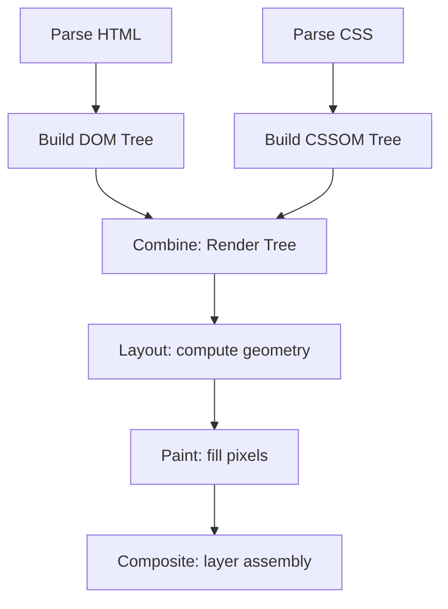

# CSS Introduction

## Introduction

Cascading Style Sheets (CSS) is the presentation layer of the web. It controls layout, typography, color, spacing, animation, and how content adapts across screen sizes and devices.

Modern CSS is far more powerful than most engineers use day-to-day. Features like container queries, CSS custom properties, cascade layers, and grid subgrid are production-ready and widely supported.

---

## Why it matters

Skipping deep CSS knowledge creates real problems in production:
- **Layout regressions** when a new component unexpectedly inherits styles
- **Specificity wars** that lead to `!important` abuse
- **Angular ViewEncapsulation** misuse causing style leaks between components
- **CLS (Cumulative Layout Shift)** from improperly sized images or dynamic content

A senior engineer understands the CSS cascade as deeply as they understand JavaScript closures.

---

## Simple Explanation

CSS works by selecting HTML elements and applying declarations to them:

```css
h1 {
  font-size: 2rem;
  color: #1a1a2e;
}
```

The browser applies styles by evaluating three things in order:
1. **Origin** — browser default, user stylesheet, or author stylesheet
2. **Specificity** — which selector is more specific
3. **Order** — later declarations win when specificity is equal

---

## Technical Explanation

### The Cascade

The cascade determines which declaration wins when multiple rules target the same property on the same element. Priority from highest to lowest:

1. `!important` declarations (avoid in production)
2. Inline styles (`style="..."`)
3. ID selectors (`#id`)
4. Class, attribute, pseudo-class selectors (`.class`, `[attr]`, `:hover`)
5. Type selectors and pseudo-elements (`h1`, `::before`)
6. Universal selector (`*`)

### Specificity Calculation

Specificity is a three-part value `(A, B, C)`:
- A: Count of ID selectors
- B: Count of class/attribute/pseudo-class selectors
- C: Count of type selectors

```css
/* Specificity: (0, 0, 1) */
h1 { color: red; }

/* Specificity: (0, 1, 1) */
.title h1 { color: blue; }

/* Specificity: (1, 0, 0) */
#page-title { color: green; }
```

### Inheritance

Some properties inherit from parent to child (`color`, `font-size`, `font-family`). Others do not (`border`, `padding`, `background`). The `inherit`, `initial`, and `unset` keywords give explicit control.

---

## How the Browser Applies CSS



---

## Angular and ViewEncapsulation

Angular wraps component styles using **ViewEncapsulation** to scope styles to the component. The default mode (`Emulated`) adds a unique attribute to elements and rewrites selectors.

```typescript
@Component({
  selector: 'app-card',
  template: `<div class="card"><ng-content /></div>`,
  styles: [`
    .card {
      border-radius: 8px;
      padding: 1rem;
    }
  `],
  encapsulation: ViewEncapsulation.Emulated, // default
})
export class CardComponent {}
```

Angular rewrites `.card` to `.card[_nghost-abc123]` — it only applies inside this component.

**Modes:**
- `Emulated` — scoped via attribute selectors (default)
- `None` — global styles, dangerous without discipline
- `ShadowDom` — true native Shadow DOM

---

## Performance Notes

- CSS blocks rendering — the browser cannot paint until all stylesheets are downloaded and parsed
- Avoid universal selector (`*`) with complex right-hand selectors
- CSS custom properties have minimal performance cost
- Animation `transform` and `opacity` run on the compositor thread (no layout cost)
- Avoid animating `width`, `height`, `top`, `left` — they trigger layout

---

## Accessibility Notes

- Color must not be the only way to convey information (WCAG 1.4.1)
- Minimum contrast ratio: 4.5:1 for normal text, 3:1 for large text
- `font-size` should use `rem` or `em` so users can scale text in browser settings
- `outline: none` without a focus replacement breaks keyboard navigation

---

## Common Mistakes

| Mistake | Problem | Fix |
|---|---|---|
| Overusing `!important` | Breaks cascade, creates unmaintainable code | Increase selector specificity instead |
| `px` for font sizes | Ignores user browser zoom | Use `rem` |
| Removing `outline` | Breaks keyboard navigation | Style it, don't remove it |
| Deep descendant selectors | Brittle, easy to break | Use BEM or limit nesting depth |
| `position: absolute` without context | Unpredictable positioning | Set `position: relative` on parent |

---

## Best Practices

- Use CSS custom properties for design tokens (colors, spacing, typography)
- Write mobile-first media queries — `min-width` scales up, not down
- Prefer class selectors over tag selectors for reusability
- Keep Angular component styles scoped (don't use `ViewEncapsulation.None` lightly)
- Use `logical properties` (`margin-inline`, `padding-block`) for RTL support

---

## Interview Questions

**Q (Easy): What is specificity and how does it affect style application?**

Specificity determines which CSS rule wins when multiple rules target the same element and property. It's calculated as a three-number weight based on selector types — IDs score highest, then classes and pseudo-classes, then type selectors. The rule with the highest specificity wins. When specificity ties, the last declaration in source order wins.

**Q (Medium): What is the difference between `display: none`, `visibility: hidden`, and `opacity: 0`?**

All three hide an element visually, but differ in behavior:
- `display: none` — removes the element from layout flow, no space taken, not accessible to screen readers
- `visibility: hidden` — element is invisible but retains its space in layout; children can override with `visibility: visible`
- `opacity: 0` — element is invisible but retains space, remains interactive (clicks still register), still accessible to screen readers

**Q (Hard): Explain the stacking context and when it is created.**

A stacking context is a three-dimensional conceptual layer that determines how elements overlap on the z-axis. An element creates a new stacking context when it has `position: relative/absolute/fixed/sticky` with a `z-index` other than `auto`, `opacity` less than 1, `transform`, `filter`, `will-change`, `isolation: isolate`, or several other properties. Within a stacking context, child z-index values only compete with siblings — they cannot escape to compete with elements in parent contexts. This is why a high `z-index` inside a low-stacking-context parent may still render below an element outside that context.

---

## 30-Second Answer

CSS applies styles through the cascade: browser defaults → user styles → author styles. When multiple rules target the same property, specificity decides the winner — IDs beat classes beat tags. Properties like `color` inherit to children; others like `border` don't. Angular's ViewEncapsulation scopes component styles using attribute selectors in Emulated mode. For performance, animate only `transform` and `opacity` to stay on the compositor thread.

---

## Exercises

1. Create a specificity calculator — predict which color applies to `<h1 id="title" class="heading">` given several competing rules.
2. Build an Angular component and demonstrate the difference between `ViewEncapsulation.Emulated`, `None`, and `ShadowDom` by inspecting the generated HTML.
3. Identify every CSS property that creates a stacking context in your Angular app's main component.

---

## Cheat Sheet

```
Specificity weight:
  (ID, Class/Pseudo-class/Attr, Tag)
  #id = (1,0,0)
  .class = (0,1,0)
  h1 = (0,0,1)
  h1.title = (0,1,1)
  #main .card h1 = (1,1,1)

Inheritance:
  Inherits: color, font-*, line-height, text-*
  Doesn't: border, margin, padding, background, display

Box Model:
  content → padding → border → margin
  box-sizing: border-box includes padding+border in width

Display:
  block, inline, inline-block, flex, grid, none

Position:
  static (default), relative, absolute, fixed, sticky
```

---

## Summary

CSS applies styles through the cascade and specificity system. Understanding which declaration wins — and why — prevents the `!important` anti-pattern. In Angular, ViewEncapsulation determines whether component styles are globally applied or scoped. For performance, limit layout-triggering animations and prefer `transform`/`opacity`.

---

## Official References

- [MDN CSS Reference](https://developer.mozilla.org/en-US/docs/Web/CSS/Reference)
- [CSS Cascade Specification (W3C)](https://www.w3.org/TR/css-cascade-5/)
- [Angular ViewEncapsulation](https://angular.dev/guide/components/styling#view-encapsulation)

---

## Related Topics

- **Next:** [Box Model](./box-model)
- **Related:** [Angular Components](/docs/angular/components)
- **Related:** [HTML Introduction](/docs/html/introduction)
