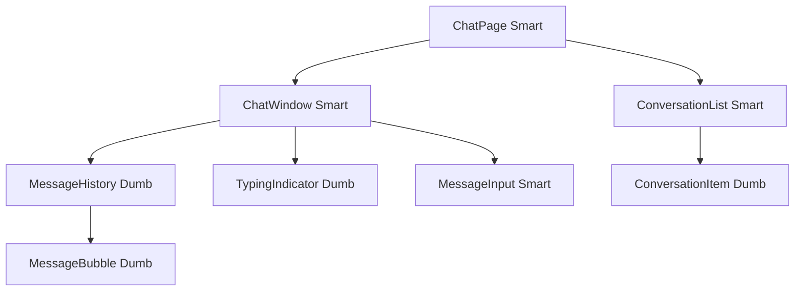

# Design a Chat Application

## Problem Statement

Design the frontend for a chat application like Slack or WhatsApp Web with:
- Real-time message delivery
- Multiple conversation threads
- Message history (pagination)
- Online/offline presence
- File/image sharing

---

## Requirements

**Functional:**
- Send and receive text messages in real-time
- View message history (load more on scroll)
- Show read receipts and typing indicators
- Support images and file attachments
- Show online/offline status

**Non-functional:**
- Messages delivered within 200ms
- History loads within 1s
- Works with 10,000 concurrent users
- Mobile-first responsive layout

---

## Component Architecture



---

## State Design

```typescript
interface ChatState {
  conversations: Record<string, Conversation>;
  activeConversationId: string | null;
  messages: Record<string, Message[]>;   // keyed by conversationId
  pendingMessages: Record<string, Message[]>; // optimistic
  typingUsers: Record<string, string[]>;
  connectionStatus: 'connected' | 'disconnected' | 'reconnecting';
}
```

---

## WebSocket Architecture

```typescript
@Injectable({ providedIn: 'root' })
export class ChatWebSocketService {
  private ws?: WebSocket;
  private readonly messages$ = new Subject<ChatMessage>();
  private readonly reconnectAttempts = signal(0);

  connect(token: string): void {
    this.ws = new WebSocket(`wss://api.chat.com/ws?token=${token}`);

    this.ws.onmessage = (event) => {
      this.messages$.next(JSON.parse(event.data));
    };

    this.ws.onclose = () => {
      if (this.reconnectAttempts() < 5) {
        setTimeout(() => this.connect(token),
          Math.pow(2, this.reconnectAttempts()) * 1000);
        this.reconnectAttempts.update(n => n + 1);
      }
    };
  }

  send(message: ChatMessage): void {
    this.ws?.send(JSON.stringify(message));
  }

  getMessages(): Observable<ChatMessage> {
    return this.messages$.asObservable();
  }
}
```

---

## Optimistic Updates

Show the message immediately before server confirmation:

```typescript
sendMessage(text: string): void {
  const tempId = crypto.randomUUID();
  const optimistic: Message = {
    id: tempId,
    text,
    status: 'pending',
    timestamp: new Date(),
  };

  // Show immediately
  this._messages.update(msgs => [...msgs, optimistic]);

  // Send to server
  this.wsService.send({ text, clientId: tempId });

  // Server confirms with real ID — replace optimistic
  // wsService.messages$.pipe(
  //   filter(m => m.clientId === tempId),
  //   take(1)
  // ).subscribe(confirmed => replaceMessage(tempId, confirmed));
}
```

---

## Pagination — Loading Message History

```typescript
loadMoreMessages(conversationId: string): void {
  const oldestMessage = this.messages()[0];
  this.http.get<Message[]>('/api/messages', {
    params: {
      conversationId,
      before: oldestMessage.timestamp,
      limit: '50',
    }
  }).subscribe(older => {
    this._messages.update(msgs => [...older, ...msgs]);
  });
}
```

---

## Interview Questions

**Q: How do you handle message ordering when messages can arrive out of order?**

Assign each message a sequence number or monotonic timestamp server-side. Sort messages by sequence before rendering. When a gap is detected (missing sequence number), show a loading indicator and request the missing range from the REST API.

**Q: How would you implement typing indicators efficiently?**

Debounce the "user is typing" event on input — send only when the user starts typing, not on every keystroke. Send a "stopped typing" event after 2 seconds of silence. On the receiver side, show the indicator immediately and remove it either on receipt of "stopped typing" or after a 3-second timeout.

---

## Related Topics

- **Previous:** [Dashboard](./dashboard)
- **Next:** [File Upload](./file-upload)
