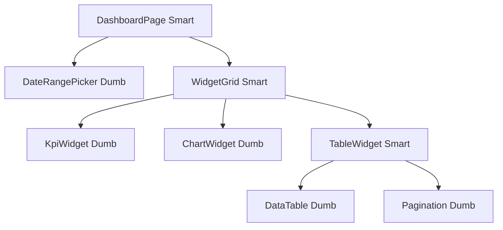

# Design a Dashboard

## Problem Statement

Design a frontend for an analytics dashboard that:
- Displays real-time metrics (revenue, active users, conversion rate)
- Shows charts and data tables
- Supports multiple widget types
- Updates automatically when data changes
- Handles 10,000 daily users

---

## Requirements Clarification

**Functional:**
- Display KPI cards (numbers with trend)
- Line/bar charts for time-series data
- Sortable/filterable data tables
- Date range picker
- Widget customization

**Non-functional:**
- Updates within 5 seconds of data change
- Lighthouse Performance ≥ 90
- Works on mobile
- Accessible (WCAG AA)

---

## Component Architecture



---

## State Design

```typescript
interface DashboardState {
  dateRange: DateRange;
  widgets: Widget[];
  loading: boolean;
  error: string | null;
}

@Injectable({ providedIn: 'root' })
export class DashboardStore {
  private readonly _state = signal<DashboardState>(initialState);

  readonly widgets = computed(() => this._state().widgets);
  readonly loading = computed(() => this._state().loading);
  readonly dateRange = computed(() => this._state().dateRange);

  setDateRange(range: DateRange) {
    this._state.update(s => ({ ...s, dateRange: range }));
    this.refreshWidgets();
  }
}
```

---

## Real-Time Updates Strategy

```
Polling (simple):
  setInterval(() => fetchMetrics(), 5000)
  Pros: simple, works everywhere
  Cons: unnecessary requests if no data change

WebSocket (optimal):
  const ws = new WebSocket('wss://api.example.com/dashboard');
  ws.onmessage = (event) => updateWidget(JSON.parse(event.data));
  Pros: instant updates, low overhead
  Cons: connection management, reconnection logic

Server-Sent Events (one-way):
  const es = new EventSource('/api/metrics/stream');
  es.onmessage = (event) => updateWidget(JSON.parse(event.data));
  Pros: simple, auto-reconnect, HTTP/2 compatible
  Cons: one-way only
```

**Decision:** Use WebSocket for dashboards that need < 1s latency. Use polling (5–30s) for operational dashboards where near-real-time is sufficient.

---

## Performance

- `@defer (on viewport)` for charts below the fold
- `CdkVirtualScrollViewport` for data tables with >100 rows
- `shareReplay(1)` for HTTP requests shared across widgets
- `OnPush` on all components
- Skeleton loaders for perceived performance

---

## Interview Questions

**Q: How would you handle a dashboard widget that fails to load?**

Each widget should have its own error boundary — an error in one widget shouldn't break the entire dashboard. Use `catchError` in the widget's data stream to return an error state. The widget template uses `@if (state.status === 'error')` to show a retry button. The retry calls `state.retry()` which re-triggers the data fetch.

---

## Related Topics

- **Previous:** [Design Framework](./design-framework)
- **Next:** [Chat Application](./chat-application)
