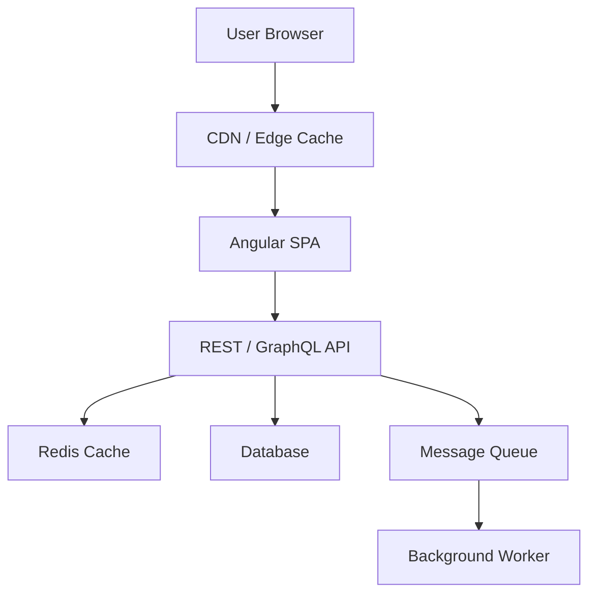

# Frontend System Design Framework

## The 7-Step Framework

Use this for every system design question. Interviewers reward structure over speed.

---

## Step 1 — Clarify Requirements (5 min)

Never start designing without asking questions.

**Functional requirements:**
- What does the system do?
- Who are the users?
- What are the primary interactions?

**Non-functional requirements:**
- How many users / requests per second?
- What is the expected latency target?
- Accessibility requirements?
- Offline support needed?
- Mobile vs desktop?

**Out of scope:**
- What won't you design?
- Authentication? (say "assume it exists")

---

## Step 2 — High-Level Architecture

Sketch the major layers:



---

## Step 3 — Component Architecture

Define the component tree:

```
Page (Smart) → Container A (Smart) → Card (Dumb)
             → Container B (Smart) → Table (Dumb) → Row (Dumb)
```

Rules:
- Smart components inject services, fetch data
- Dumb components receive `input()`, emit `output()`
- Max 3 levels of nesting before extracting

---

## Step 4 — State Management

Classify state:

| Type | Where it lives | Tool |
|---|---|---|
| Server state | Component or store | HTTP + signal store |
| Shared client state | Global store | Signal service |
| Local UI state | Component | Local signals |
| URL state | Browser URL | Router query params |
| Form state | Component | Reactive forms |

---

## Step 5 — Data / API Design

Define the API contract:

```typescript
// GET /api/dashboard
interface DashboardResponse {
  widgets: Widget[];
  meta: { lastUpdated: string };
}

// POST /api/widgets
interface CreateWidgetRequest {
  type: WidgetType;
  config: WidgetConfig;
  position: { row: number; col: number };
}
```

Define: pagination strategy (cursor vs offset), error response format, real-time updates (polling vs WebSocket vs SSE).

---

## Step 6 — Performance Strategy

Address each CWV metric:
- **LCP** — SSR, priority images, lazy routes
- **INP** — OnPush, signals, virtual scroll, workers
- **CLS** — explicit image dimensions, reserved space

---

## Step 7 — Trade-offs

Always discuss alternatives:
- "I chose signals over RxJS BehaviorSubject because..."
- "I used WebSockets instead of polling because..."
- "At 10x scale, I would add a client-side cache because..."

---

## Related Topics

- **Next:** [Dashboard Design](./dashboard)
- **Related:** [Angular Architecture](/docs/angular/introduction)
