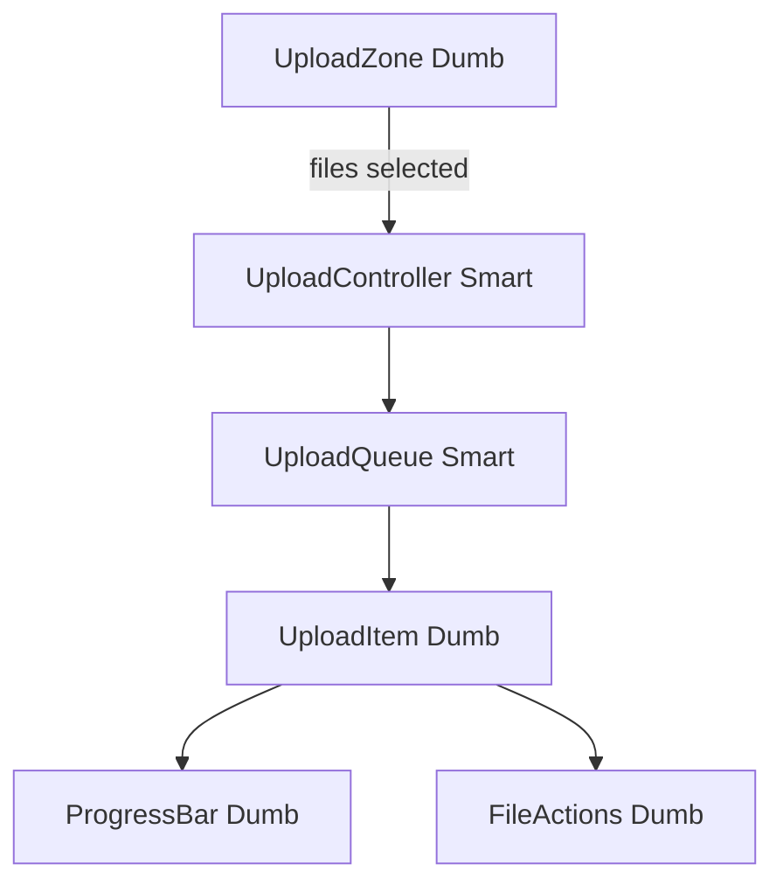

# Design a File Upload System

## Problem Statement

Design a file upload component that:
- Supports large files (up to 5GB)
- Shows upload progress
- Handles network failures with retry
- Supports pause and resume
- Validates file type and size before upload

---

## Requirements

**Functional:**
- Single and multi-file upload
- Progress bar per file and overall
- Pause, resume, cancel
- Retry failed uploads
- Preview images before upload
- File type and size validation

**Non-functional:**
- Resume upload from last successful chunk after network failure
- Max file size: 5GB
- Chunk size: 5MB
- Concurrent uploads: up to 3 files

---

## Component Architecture

```typescript
interface UploadFile {
  id: string;
  file: File;
  status: 'pending' | 'uploading' | 'paused' | 'complete' | 'error';
  progress: number;           // 0–100
  uploadedBytes: number;
  uploadId?: string;          // server-assigned multipart ID
  lastChunkIndex: number;
  error?: string;
}
```



---

## Chunked Upload Implementation

```typescript
@Injectable({ providedIn: 'root' })
export class ChunkedUploadService {
  private readonly CHUNK_SIZE = 5 * 1024 * 1024; // 5MB

  upload(file: File): Observable<UploadProgress> {
    return new Observable(subscriber => {
      this.startMultipartUpload(file).pipe(
        switchMap(({ uploadId }) =>
          this.uploadChunks(file, uploadId)
        ),
        switchMap(({ uploadId, parts }) =>
          this.completeUpload(uploadId, parts)
        )
      ).subscribe({
        next: (progress) => subscriber.next(progress),
        error: (err) => subscriber.error(err),
        complete: () => subscriber.complete(),
      });
    });
  }

  private uploadChunks(file: File, uploadId: string): Observable<ChunkResult[]> {
    const chunks = Math.ceil(file.size / this.CHUNK_SIZE);
    const chunkUploads = Array.from({ length: chunks }, (_, i) => {
      const start = i * this.CHUNK_SIZE;
      const end = Math.min(start + this.CHUNK_SIZE, file.size);
      const blob = file.slice(start, end);

      return this.uploadChunk(blob, uploadId, i).pipe(
        retry(3)
      );
    });

    // Upload max 3 chunks concurrently
    return from(chunkUploads).pipe(
      mergeMap(chunk$ => chunk$, 3),
      toArray()
    );
  }
}
```

---

## Validation

```typescript
interface UploadValidation {
  maxSizeBytes: number;
  allowedTypes: string[];   // MIME types
  maxFiles: number;
}

function validateFile(file: File, rules: UploadValidation): string | null {
  if (file.size > rules.maxSizeBytes) {
    return `File too large. Max: ${formatBytes(rules.maxSizeBytes)}`;
  }
  if (!rules.allowedTypes.includes(file.type)) {
    return `File type not allowed: ${file.type}`;
  }
  return null; // valid
}
```

---

## Interview Questions

**Q: How do you implement resume-able uploads after a network failure?**

Use multipart/resumable upload: the server assigns an `uploadId` at the start. Each chunk is numbered. On failure, call `GET /api/upload/{uploadId}/status` to find out which chunks were received. Resume from the first missing chunk. The server stores partial uploads and assembles them after all chunks arrive and `complete` is called.

---

## Related Topics

- **Previous:** [Chat Application](./chat-application)
- **Next:** [Component Library](./component-library)
