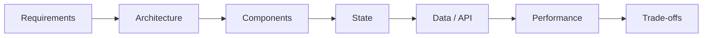

# Frontend System Design

## Introduction

Frontend system design interviews ask you to design a complex UI feature at scale — a dashboard, a chat application, a file upload system. Unlike backend system design (databases, load balancers), frontend design focuses on component architecture, state management, data fetching strategies, real-time updates, and performance.

Senior engineers at JPMorgan, Microsoft, and Adobe face this round regularly.

---

## The Design Framework

Use this framework for any frontend system design question:

### 1. Requirements (5 minutes)
- Functional requirements: what the system does
- Non-functional: performance targets, scale, accessibility
- Out of scope: what you won't design

### 2. Architecture
- Folder structure, feature modules, lazy loading
- Monorepo vs multi-repo considerations
- Micro-frontends if warranted

### 3. Components
- Component tree — smart vs dumb
- Reusable component library decisions
- API design of each component

### 4. State Management
- What state exists? (server state, client state, UI state)
- Where does it live? (signal store, service, URL params)
- How does it flow? (input/output, signals, events)

### 5. Data / API
- REST vs GraphQL vs WebSocket
- Caching strategy
- Loading, error, and empty states

### 6. Performance
- Lazy loading, virtual scrolling, pagination
- Bundle splitting
- Core Web Vitals targets

### 7. Trade-offs
- What you chose and why
- What you would do differently at 10x scale

---

## Cases in This Section

| System | Concepts |
|---|---|
| [Dashboard](./dashboard) | Data visualization, polling, real-time updates |
| [Chat Application](./chat-application) | WebSockets, message ordering, pagination |
| [File Upload](./file-upload) | Chunked upload, progress, retry |
| [Component Library](./component-library) | API design, accessibility, theming |

---

## Official References

- [Angular Architecture Guide](https://angular.dev/guide/architecture)
- [Frontend System Design Interviews](https://www.greatfrontend.com/system-design)

---

## Related Topics

- **Related:** [Machine Coding](/docs/machine-coding/introduction)
- **Related:** [Angular Introduction](/docs/angular/introduction)
- **Related:** [Performance Introduction](/docs/performance/introduction)
---

## Related Topics

- **Next:** [Design Framework](./design-framework)
- **Related:** [Machine Coding](/docs/machine-coding/introduction)
- **Related:** [Angular Introduction](/docs/angular/introduction)