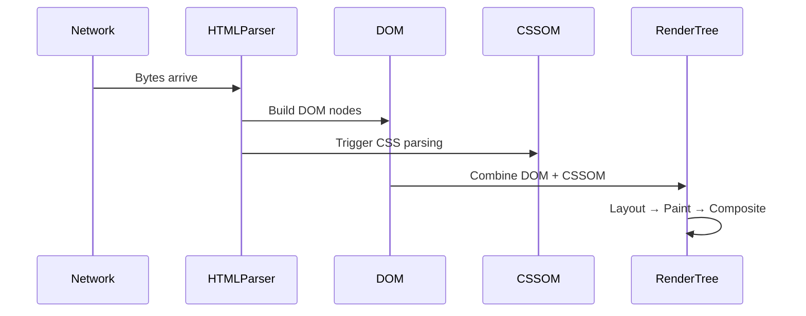

# HTML Introduction

## Introduction

HyperText Markup Language (HTML) is the structural layer of every webpage. It defines the meaning and organization of content — what is a heading, what is a paragraph, what is a form, and what is a navigation landmark.

HTML is not just markup syntax. It is the contract between your content and the browser, search engines, assistive technologies, and crawlers. A well-structured HTML document works correctly without a single line of CSS or JavaScript.

---

## Why it matters

Every senior engineer should know HTML deeply because:

- **Accessibility starts with semantics** — screen readers navigate by HTML structure, not visual appearance
- **SEO depends on document structure** — search engines index headings, landmark regions, and link text
- **Performance is affected by HTML order** — render-blocking resources, lazy loading, and critical path depend on markup decisions
- **JavaScript frameworks output HTML** — understanding what Angular templates produce in the DOM is essential for debugging

---

## Simple Explanation

HTML uses tags to annotate content. A tag looks like `<tagname>` and most tags have a closing counterpart `</tagname>`.

```html
<h1>Hello World</h1>
<p>This is a paragraph.</p>
```

The browser reads these tags and builds a tree of objects called the DOM (Document Object Model). Everything you do with CSS and JavaScript operates on this tree.

---

## Technical Explanation

The browser parses HTML using an incremental tokenizer. As bytes arrive from the network, the HTML parser converts them to tokens, then constructs DOM nodes. This process is called the **HTML parsing algorithm**, defined in the [WHATWG HTML Living Standard](https://html.spec.whatwg.org/).

Key characteristics:
- **Error recovery** — HTML parsers are extremely lenient and recover from malformed markup
- **Tree construction** — nodes are inserted into the DOM as they are parsed (not after the whole document is received)
- **Blocking** — `<script>` tags without `async` or `defer` pause parsing until the script is downloaded and executed

---

## How the Browser Processes HTML



---

## Document Structure

A valid HTML document has:

```html
<!DOCTYPE html>
<html lang="en">
  <head>
    <meta charset="UTF-8" />
    <meta name="viewport" content="width=device-width, initial-scale=1.0" />
    <title>Page Title</title>
  </head>
  <body>
    <main>
      <h1>Main Heading</h1>
      <p>Content here.</p>
    </main>
  </body>
</html>
```

- `<!DOCTYPE html>` — signals HTML5 to the browser
- `lang="en"` — enables correct text-to-speech pronunciation
- `charset="UTF-8"` — ensures international characters render correctly
- `viewport` meta — controls scaling on mobile devices

---

## Angular Example

Angular components compile to real HTML. Understanding what they produce is essential for debugging.

```typescript
// app.component.ts
@Component({
  selector: 'app-root',
  standalone: true,
  template: `
    <main>
      <header>
        <h1>{{ title }}</h1>
        <nav aria-label="Main navigation">
          <ul>
            @for (item of navItems; track item.id) {
              <li><a [href]="item.url">{{ item.label }}</a></li>
            }
          </ul>
        </nav>
      </header>
      <article>
        <ng-content />
      </article>
    </main>
  `,
})
export class AppComponent {
  title = 'Learning Guide';
  navItems = [
    { id: 1, url: '/html', label: 'HTML' },
    { id: 2, url: '/css', label: 'CSS' },
  ];
}
```

Angular's template compiler preserves the semantic structure. The `@for` loop generates real `<li>` elements — the browser and screen readers see proper list markup.

---

## Performance Notes

- Place `<link rel="stylesheet">` in `<head>` — stylesheets block rendering but must be available before first paint
- Use `defer` on non-critical scripts: `<script src="app.js" defer></script>`
- Use `async` only for scripts with no dependencies
- Images should have explicit `width` and `height` attributes to prevent Layout Shift (CLS)
- Use `<link rel="preload">` for critical fonts and images

---

## Accessibility Notes

- Every `` needs `alt` text — empty `alt=""` for decorative images
- Heading hierarchy must not skip levels (`h1` → `h2` → `h3`)
- Interactive elements must be keyboard navigable
- Use semantic elements instead of `<div>` and `<span>` for landmark regions
- Labels must be associated with form controls via `for`/`id` or `aria-labelledby`

---

## Common Mistakes

| Mistake | Problem | Fix |
|---|---|---|
| Using `<div>` for everything | No semantic meaning | Use `<article>`, `<section>`, `<nav>`, `<main>` |
| Skipping heading levels | Breaks screen reader navigation | Use headings hierarchically |
| Missing `lang` attribute | Wrong TTS pronunciation | Add `lang="en"` to `<html>` |
| `<table>` for layout | Breaks screen readers | Use CSS Grid or Flexbox |
| Images without `alt` | Inaccessible to screen readers | Always include `alt` |

---

## Best Practices

- One `<h1>` per page — it describes the page topic
- Use `<main>` to mark the primary content area
- Use `<nav>` with `aria-label` to distinguish multiple navigation landmarks
- Prefer `<button>` over `<div onclick>` for interactive elements
- Validate HTML at [validator.w3.org](https://validator.w3.org)

---

## Interview Questions

### Easy

**Q: What is the difference between `<div>` and `<section>`?**

`<div>` has no semantic meaning — it is a generic grouping element used for styling. `<section>` represents a thematically grouped area of content and is a landmark region for assistive technologies.

**Q: What does `<!DOCTYPE html>` do?**

It tells the browser to parse the document in standards mode (HTML5). Without it, browsers may fall back to "quirks mode" which emulates old, inconsistent browser behavior.

### Medium

**Q: How does `defer` differ from `async` on a `<script>` tag?**

Both download scripts without blocking HTML parsing. `defer` executes scripts in document order after parsing is complete. `async` executes scripts as soon as they are downloaded, in any order — suitable for analytics or independent scripts.

### Hard

**Q: Explain the HTML parsing algorithm's error recovery behavior.**

The HTML5 specification defines a deterministic error recovery algorithm. When the parser encounters invalid markup (like unclosed tags), it inserts implied tags according to specific rules. This is why `<table><td>text</td></table>` renders differently than expected — the parser inserts `<tbody>` and `<tr>` automatically.

---

## 30-Second Answer

HTML defines document structure using semantic elements. The browser parses HTML into the DOM — a tree that JavaScript and CSS operate on. Good HTML uses semantic tags (`<main>`, `<article>`, `<nav>`), correct heading hierarchy, and proper form labeling. This improves accessibility, SEO, and performance.

---

## Senior Answer

HTML is the contract between your application and the browser's accessibility tree. Angular components compile to HTML — understanding what they emit in the DOM is essential when debugging focus management or landmark navigation. The HTML parsing algorithm is forgiving by design but creates implicit DOM nodes that can break layouts unexpectedly. Performance-critical markup decisions include render-blocking scripts, above-the-fold image sizing for CLS, and preloading critical assets. In production Angular apps, server-side rendering improves LCP because the browser receives fully-formed HTML rather than waiting for JavaScript to hydrate the DOM.

---

## Exercises

1. Build a semantic blog post layout using `<article>`, `<header>`, `<footer>`, `<aside>`, and `<nav>` without any CSS.
2. Open an Angular app you have built and inspect the DOM. Identify which semantic elements Angular generated and which are generic `<div>` containers.
3. Validate an existing page at [validator.w3.org](https://validator.w3.org) and fix every error.
4. Build a fully accessible form with labels, fieldsets, legends, and appropriate input types.

---

## Cheat Sheet

```
Document structure:
  <!DOCTYPE html>          → HTML5 mode
  <html lang="en">         → Language declaration
  <head>                   → Metadata (not visible)
  <body>                   → Visible content

Landmark elements:
  <main>                   → Primary content (one per page)
  <nav>                    → Navigation links
  <header>                 → Introductory content
  <footer>                 → Footer content
  <aside>                  → Secondary content
  <article>                → Self-contained content
  <section>                → Thematic grouping

Text:
  <h1>–<h6>               → Headings (hierarchical)
  <p>                      → Paragraph
  <strong>                 → Important text (bold)
  <em>                     → Emphasised text (italic)
  <code>                   → Inline code
  <pre>                    → Preformatted text

Links and media:
  <a href="">              → Hyperlink
        → Image
  <video>, <audio>         → Media
  <figure>, <figcaption>   → Media with caption

Script loading:
  <script defer>           → Execute after parse, in order
  <script async>           → Execute when ready, any order
```

---

## Summary

HTML is the structural backbone of the web. Semantic elements communicate meaning to browsers, search engines, and assistive technologies. The browser parses HTML incrementally and builds the DOM. Script loading strategy affects performance. Every Angular component ultimately outputs HTML — mastering it makes you a better Angular developer.

---

## Official References

- [WHATWG HTML Living Standard](https://html.spec.whatwg.org/)
- [MDN HTML Reference](https://developer.mozilla.org/en-US/docs/Web/HTML)
- [W3C Accessibility Guidelines (WCAG)](https://www.w3.org/WAI/WCAG21/quickref/)

---

## Related Topics

- **Next:** [Document Structure](./document-structure)
- **Related:** [CSS Introduction](/docs/css/introduction)
- **Related:** [Browser Rendering Pipeline](/docs/browser/rendering-pipeline)
- **Prerequisites:** None
