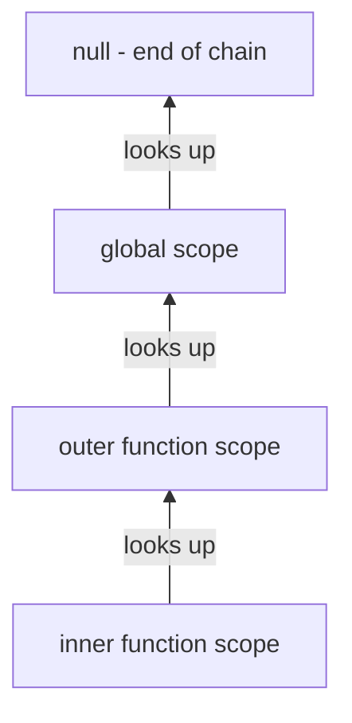

# JavaScript Closures

## Introduction

A closure is a function that retains access to variables from its outer lexical scope even after the outer function has finished executing. Closures are not a special syntax — they are a direct consequence of how JavaScript resolves variable names through the scope chain.

Every function in JavaScript forms a closure. The meaningful case is when a function accesses variables from a scope that has already returned.

---

## Why it matters

- Closures are the foundation of every JavaScript module pattern, factory function, and memoization technique
- Angular services capture injected dependencies in closures
- The `inject()` function itself requires an active injection context — a form of closure-based scoping
- The classic interview "loop closure bug" appears in real Angular code with event handlers in `*ngFor`

---

## How Closures Work

```javascript
function createCounter(start = 0) {
  let count = start; // captured in closure

  return {
    increment() { count++;        },
    decrement() { count--;        },
    reset()     { count = start;  },
    value()     { return count;   },
  };
}

const counter = createCounter(10);
counter.increment();
counter.increment();
console.log(counter.value()); // 12

// 'count' is not accessible from outside
console.log(typeof count); // 'undefined'
```

`count` lives as long as the returned object does. The garbage collector cannot collect it because the closure holds a live reference.

---

## The Scope Chain



When JavaScript looks up a variable name, it starts in the current scope and walks up the chain until found or reaching `null`.

---

## Factory Functions

```javascript
// Creates customized functions with captured configuration
function multiplier(factor) {
  return (n) => n * factor; // captures 'factor'
}

const double = multiplier(2);
const triple = multiplier(3);

console.log(double(5));  // 10
console.log(triple(5));  // 15

// Angular equivalent — service factory
function createApiClient(baseUrl: string) {
  return {
    get: (path: string) => fetch(`${baseUrl}${path}`),
    post: (path: string, data: unknown) =>
      fetch(`${baseUrl}${path}`, { method: 'POST', body: JSON.stringify(data) }),
  };
}
```

---

## The Classic Loop Bug

```javascript
// Bug — var is function-scoped, all callbacks share the same 'i'
for (var i = 0; i < 3; i++) {
  setTimeout(() => console.log(i), 0);
}
// Output: 3, 3, 3  (not 0, 1, 2)

// Fix 1 — let is block-scoped, new binding per iteration
for (let i = 0; i < 3; i++) {
  setTimeout(() => console.log(i), 0);
}
// Output: 0, 1, 2

// Fix 2 — IIFE creates a new scope per iteration
for (var i = 0; i < 3; i++) {
  ((j) => setTimeout(() => console.log(j), 0))(i);
}
// Output: 0, 1, 2
```

**Angular context:** The same bug appears with `*ngFor` + `(click)` handlers that capture `index` using `var`. Always use `let` (Angular's default in TypeScript).

---

## Memoization

```typescript
function memoize<T extends (...args: unknown[]) => unknown>(fn: T): T {
  const cache = new Map<string, ReturnType<T>>();

  return ((...args: unknown[]) => {
    const key = JSON.stringify(args);
    if (cache.has(key)) return cache.get(key);
    const result = fn(...args) as ReturnType<T>;
    cache.set(key, result);
    return result;
  }) as T;
}

// Expensive calculation — only computed once per unique input
const expensiveFilter = memoize((items: Item[], query: string) =>
  items.filter(i => i.name.toLowerCase().includes(query.toLowerCase()))
);

// Angular: computed() signals are memoized automatically
const filteredItems = computed(() =>
  items().filter(i => i.name.includes(query()))
);
```

---

## The Module Pattern

```typescript
// IIFE creates a private scope
const UserStore = (() => {
  // Private state — not accessible outside
  let _users: User[] = [];
  let _loading = false;

  // Public API
  return {
    getUsers: () => [..._users],     // returns copy, not reference
    isLoading: () => _loading,
    setUsers: (users: User[]) => { _users = users; },
    setLoading: (v: boolean) => { _loading = v; },
  };
})();

UserStore.setUsers([{ id: '1', name: 'Alice' }]);
console.log(UserStore.getUsers()); // [{ id: '1', name: 'Alice' }]
// UserStore._users — undefined (private)
```

Angular services are essentially the module pattern in class form — `private` properties backed by `@Injectable` provide the same encapsulation.

---

## Angular Services and Closures

Angular's `inject()` function captures the injection context at call time:

```typescript
// This works — inject() called during construction (closure over injection context)
@Component({ standalone: true })
export class MyComponent {
  private readonly service = inject(MyService); // ✓

  ngOnInit() {
    // This would fail — no injection context available after construction
    // const service = inject(MyService); // ✗ RuntimeError
  }
}

// Composition functions use closures correctly
function useFormState() {
  const fb = inject(FormBuilder);        // captured at call time
  const router = inject(Router);
  return { form: fb.group({ name: [''] }), router };
}
```

---

## Interview Questions

**Q (Easy): What is a closure and give a real-world example.**

A closure is a function that captures variables from its enclosing scope. A real example: a counter factory. `createCounter(10)` returns an object whose methods close over the private `count` variable. The variable persists as long as the object does. This pattern is the foundation of every Angular service's private state.

**Q (Medium): Explain why the loop closure bug happens and three ways to fix it.**

`var` is function-scoped — all loop iterations share the same `i` variable. When the callbacks execute after the loop completes, they all see `i = 3`. Fixes: (1) use `let` — block-scoped, creates a new binding per iteration; (2) use an IIFE to create a new scope per iteration, capturing the current `i` as a parameter; (3) use `Array.from` with `.map()` which creates a new function scope per element.

**Q (Hard): What is the difference between a closure and a reference to an object?**

Both keep values alive, but a closure captures variables by reference from its lexical scope — not by value. If the outer variable changes, the closure sees the new value. An object reference is just a pointer to a heap location. A closure is a pairing of a function and its lexical environment — the environment persists until all closures referencing it are garbage collected.

**Q (Senior): How would you use closures to implement a simple dependency injection system?**

Create a registry using a closure over a `Map<token, factory>`. A `provide(token, factory)` function stores the factory. A `resolve(token)` function calls the factory, passing itself for recursive resolution. This mirrors Angular's root injector — `inject()` looks up the current injection context (a closure), finds the provider, instantiates it (potentially resolving its own dependencies recursively), and returns the instance.

---

## 30-Second Answer

A closure is a function that retains access to its outer scope after that scope has returned. Practically: factory functions, memoization, the module pattern, and private state in services all rely on closures. The classic bug is using `var` in a loop with async callbacks — all callbacks share the same variable. Fix it with `let` (block scope) or an IIFE.

---

## Cheat Sheet

```javascript
// Closure captures outer scope
function outer() {
  let x = 10;                    // captured
  return () => x;                // inner function closes over x
}
const inner = outer();
inner(); // 10 — outer() has returned, x still lives

// Factory
const make = (n) => () => n * 2; // captures n
const double = make(5);
double(); // 10

// Memoize
const memo = (fn) => {
  const cache = {};              // captured in closure
  return (...args) => {
    const k = JSON.stringify(args);
    return cache[k] ??= fn(...args);
  };
};

// Module pattern
const mod = (() => {
  let private = 0;
  return { get: () => private, inc: () => private++ };
})();

// Loop fix
for (let i = 0; i < 3; i++) {   // let = new binding per iteration
  setTimeout(() => console.log(i), 0); // 0, 1, 2
}
```

---

## Related Topics

- **Previous:** [Classes](./classes)
- **Next:** [Prototypes](./prototypes)
- **Related:** [Angular Services](/docs/angular/services)
- **Related:** [Angular Dependency Injection](/docs/angular/dependency-injection)
