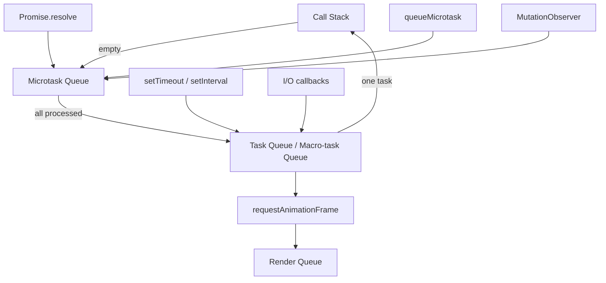
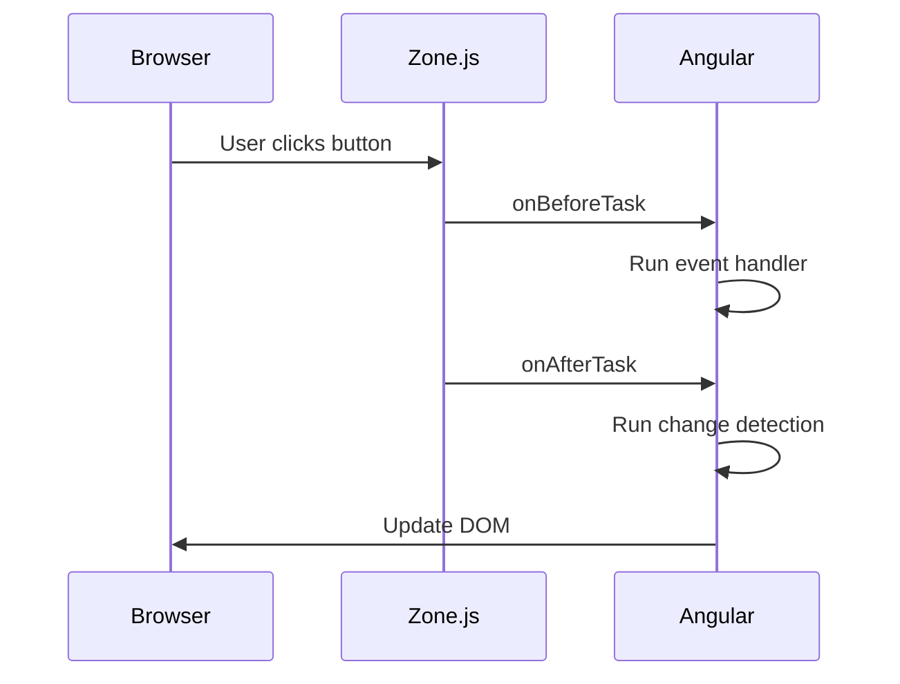

# The JavaScript Event Loop

## Introduction

The event loop is the mechanism that allows JavaScript — a single-threaded language — to handle asynchronous operations without blocking. It manages the execution order of synchronous code, promises, setTimeout, and I/O callbacks.

Every senior frontend engineer must understand this. It explains why `setTimeout(fn, 0)` doesn't run immediately, why promise callbacks execute before setTimeout callbacks, and how Angular's zone.js hooks into the event loop to trigger change detection.

---

## Why it matters

Misunderstanding the event loop causes:
- Callbacks executing in unexpected order
- UI freezes from blocking the call stack
- Race conditions in Angular components
- Incorrect assumptions about when Angular runs change detection

---

## Simple Explanation

JavaScript can only execute one thing at a time. The event loop continuously checks: "Is the call stack empty? If yes, take the next task and run it."

```
Call Stack → empty?
  Yes → check Microtask Queue → run all microtasks
  Microtask Queue empty → take one task from Task Queue → run it
  → repeat
```

---

## The Three Queues



### Call Stack

The call stack tracks function execution. When a function is called, a frame is pushed. When it returns, the frame is popped.

```javascript
function a() { b(); }
function b() { c(); }
function c() { console.log('hello'); }

a();
// Stack: a → b → c → (c returns) → (b returns) → (a returns)
```

### Microtask Queue

Processed **completely** after each task, before rendering and before the next task. Includes:
- `Promise.then/.catch/.finally` callbacks
- `queueMicrotask()`
- `MutationObserver` callbacks
- `async/await` continuations

### Task Queue (Macrotask Queue)

One task is processed per event loop iteration. Includes:
- `setTimeout` / `setInterval` callbacks
- I/O callbacks (network, file)
- UI event callbacks (click, keydown)

---

## Code Example: Execution Order

```javascript
console.log('1 - synchronous');

setTimeout(() => console.log('2 - setTimeout'), 0);

Promise.resolve()
  .then(() => console.log('3 - promise'));

queueMicrotask(() => console.log('4 - microtask'));

console.log('5 - synchronous');

// Output order:
// 1 - synchronous
// 5 - synchronous
// 3 - promise       ← microtask
// 4 - microtask     ← microtask
// 2 - setTimeout    ← macrotask (next iteration)
```

---

## Async/Await and the Microtask Queue

`async/await` is syntactic sugar over promises. Every `await` suspends the function and schedules the continuation as a microtask:

```javascript
async function fetchData() {
  console.log('A');
  const data = await fetch('/api/data'); // suspends here
  console.log('B');  // runs as microtask when fetch resolves
}

fetchData();
console.log('C');

// Output: A → C → B
```

---

## Angular and Zone.js

Angular uses Zone.js to detect when async operations complete and run change detection. Zone.js patches browser APIs (setTimeout, Promise, addEventListener, XHR) to know when a task starts and ends.



With Angular Signals, this is changing — signals bypass Zone.js and trigger targeted updates directly, making the event loop interaction more explicit.

---

## Render Loop

The browser's rendering pipeline runs between event loop iterations (roughly every 16ms for 60fps):

```
Task → Microtasks → Render → Task → Microtasks → Render → ...
```

`requestAnimationFrame` callbacks run just before rendering, making them ideal for smooth animations.

---

## Performance Notes

- Long synchronous tasks block rendering — if a function takes > 50ms, it's a "long task"
- Split long computations across multiple tasks using `setTimeout(fn, 0)` or `scheduler.postTask()`
- Microtask starvation: infinite microtask recursion prevents the browser from rendering
- Angular SSR doesn't have a browser event loop — Zone.js behaves differently on the server

---

## Common Mistakes

| Mistake | Problem | Fix |
|---|---|---|
| `setTimeout(fn, 0)` is "immediate" | It's a macrotask, runs after all microtasks | Use `queueMicrotask` or `Promise.resolve().then()` for immediate async |
| Blocking the main thread with loops | UI freezes, no paint updates | Use web workers or split into chunks |
| `await` in a loop sequentially | Each await waits for the previous | Use `Promise.all()` for parallel operations |

---

## Interview Questions

**Q (Easy): What is the difference between setTimeout and Promise in terms of execution order?**

Promises use the microtask queue; `setTimeout` uses the macrotask queue. After the call stack clears, the engine processes all microtasks first before taking the next macrotask. So `Promise.resolve().then(fn)` always runs before `setTimeout(fn, 0)`, even though both are "asynchronous."

**Q (Medium): What is microtask starvation?**

If code continuously adds microtasks (e.g., a resolved promise that adds another promise in its handler), the microtask queue never empties. The event loop can never proceed to render or handle macrotasks. This causes the page to freeze. Unlike infinite loops, microtask starvation doesn't block synchronous code — it blocks progress between tasks.

**Q (Hard): How does Zone.js patch the browser APIs to enable Angular change detection?**

Zone.js wraps all browser async APIs (setTimeout, Promise, addEventListener, XHR, fetch) by replacing them with patched versions. When a patched function is called, Zone.js knows a task has started. When the callback completes, Zone.js knows the task has ended and notifies Angular's `NgZone`. Angular then schedules change detection. This is why any async operation in Angular components (even setTimeout) triggers change detection — Zone.js intercepts it.

**Q (Senior): Explain how Angular Signals change the relationship between the event loop and change detection.**

Traditional Angular uses Zone.js to detect when any async operation (task or microtask) completes and then runs change detection for the entire component tree. Signals introduce a graph-based reactivity model where each signal tracks its consumers. When a signal's value changes synchronously, Angular marks only the affected components as dirty and schedules a targeted update via `queueMicrotask`. This reduces unnecessary change detection cycles and removes the dependency on Zone.js patching.

---

## 30-Second Answer

JavaScript is single-threaded. The event loop runs synchronous code first, then drains all microtasks (promises, queueMicrotask), then runs one macrotask (setTimeout, I/O), then renders, then repeats. Angular's Zone.js intercepts async APIs to know when to run change detection. Signals bypass Zone.js by pushing updates directly through a reactive dependency graph.

---

## Senior Answer

The event loop's microtask/macrotask distinction is critical for understanding Angular's change detection timing. Zone.js patches every async API to observe task boundaries. When a task completes, NgZone fires and Angular runs change detection from the root. This is why an http.get() completion in a deeply-nested service triggers a root-level CD cycle.

With signals, Angular moves to push-based reactivity: a signal write synchronously marks consumers dirty and schedules a targeted flush via a microtask. This removes the need for Zone.js and gives developers explicit control over when updates propagate. The practical impact: fewer CD cycles, better SSR compatibility, and no need to manually run `ChangeDetectorRef.markForCheck()` in OnPush components.

---

## Exercises

1. Predict the output of a function that combines setTimeout, Promise.resolve().then(), queueMicrotask(), and synchronous code.
2. Build an Angular service that demonstrates how Zone.js triggers change detection on setTimeout and compare it with a signal-based equivalent that doesn't need Zone.js.
3. Profile a slow Angular page in Chrome DevTools — identify long tasks and determine if they're blocking the event loop.

---

## Cheat Sheet

```
Execution Order:
  1. Synchronous code (call stack)
  2. Microtasks (all of them)
     - Promise .then/.catch/.finally
     - queueMicrotask()
     - async/await continuations
  3. Render (browser paints)
  4. One macrotask
     - setTimeout / setInterval
     - I/O callbacks
     - UI event handlers
  5. Repeat

Angular CD triggers:
  Zone.js default: any async task end
  OnPush: explicit markForCheck() or async pipe
  Signals: automatic on signal write
```

---

## Summary

The event loop is the heart of JavaScript's concurrency model. Microtasks (promises) always run before macrotasks (setTimeout). Understanding this explains Angular change detection, enables you to avoid UI freezes, and helps you write efficient async code. Angular Signals represent an evolution that makes the relationship between state changes and rendering more predictable and explicit.

---

## Official References

- [HTML Living Standard: Event Loop](https://html.spec.whatwg.org/multipage/webappapis.html#event-loops)
- [MDN: Event Loop](https://developer.mozilla.org/en-US/docs/Web/JavaScript/Event_loop)
- [Zone.js GitHub](https://github.com/angular/angular/tree/main/packages/zone.js)

---

## Related Topics

- **Previous:** [JavaScript Introduction](./introduction)
- **Next:** [Promises](./promises)
- **Related:** [Angular Change Detection](/docs/angular/change-detection)
- **Related:** [Browser Event Loop](/docs/browser/event-loop)
