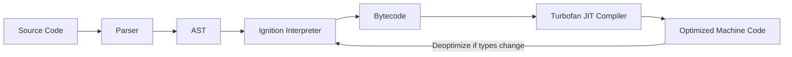

# JavaScript Introduction

## Introduction

JavaScript is the only programming language that runs natively in every web browser. It controls behavior — responding to user events, fetching data, manipulating the DOM, and driving single-page applications like Angular.

Despite its ubiquity, JavaScript is a deeply nuanced language. Its prototype-based inheritance, event-loop concurrency model, and dynamic typing produce behaviors that surprise even experienced developers. Understanding these internals is the difference between writing code that works and writing code that works reliably in production.

---

## Why it matters

Angular is written in TypeScript, which compiles to JavaScript. Every Angular template, every signal, every subscription ultimately runs as JavaScript in the browser's V8 engine. When you understand:
- How the event loop schedules your code
- How closures capture scope in services
- How prototypes affect class inheritance in Angular components
- How promises and observables interact with the microtask queue

...you debug faster, write better code, and answer interview questions with authority.

---

## Brief History

| Year | Milestone |
|---|---|
| 1995 | JavaScript created by Brendan Eich at Netscape in 10 days |
| 1997 | ECMAScript 1 standardized by ECMA International |
| 2009 | ES5 — `strict mode`, `JSON`, `Array` methods |
| 2015 | ES6/ES2015 — classes, arrow functions, promises, modules, `let/const` |
| 2017 | ES2017 — `async/await` |
| 2020+ | Optional chaining, nullish coalescing, top-level await, records & tuples |

---

## Simple Explanation

JavaScript is a single-threaded, interpreted language with dynamic typing:

```javascript
// Variables are dynamically typed
let x = 42;      // number
x = 'hello';     // now a string — no error

// Functions are first-class values
function greet(name) {
  return `Hello, ${name}`;
}

const greetArrow = (name) => `Hello, ${name}`;

// Objects are key-value maps
const user = {
  name: 'Alice',
  role: 'engineer',
  greet() {
    return `Hi, I'm ${this.name}`;
  }
};
```

---

## How V8 Executes JavaScript



V8 (Chrome/Node's engine) uses two compilers:
1. **Ignition** — converts source to bytecode quickly for fast startup
2. **TurboFan** — JIT-compiles hot code paths to optimized machine code

Type stability matters: if a variable holds a number 99% of the time but sometimes holds a string, TurboFan cannot optimize it and must deoptimize.

---

## Angular Example

Understanding JavaScript internals helps diagnose Angular issues:

```typescript
// Service with state — closure over a private variable
@Injectable({ providedIn: 'root' })
export class UserService {
  private readonly _currentUser = signal<User | null>(null);

  // The get accessor creates a closure over _currentUser
  get currentUser() {
    return this._currentUser.asReadonly();
  }

  login(user: User) {
    this._currentUser.set(user);
  }
}
```

The signal API uses closures internally — `_currentUser` is captured in the getter closure. When you call `signal.set()`, the internal value is updated and all subscribers are notified via Angular's reactive graph.

---

## Performance Notes

- V8 optimizes functions that are called frequently with consistent argument types
- Avoid mixing types in arrays — `[1, 2, 3]` is faster to iterate than `[1, 'two', 3]`
- Hidden classes: objects with the same shape (same properties in same order) share an internal representation and are faster to access
- Avoid deleting properties from objects — it changes the hidden class

---

## Common Mistakes

| Mistake | Problem | Fix |
|---|---|---|
| Using `==` instead of `===` | Type coercion causes unexpected equality | Always use `===` |
| Forgetting `var` hoisting | Variables declared with `var` are hoisted | Use `let`/`const` |
| `typeof null === 'object'` | Historical bug in spec | Use `value === null` for null checks |
| Mutating function arguments | Side effects | Return new values, don't mutate params |

---

## Interview Questions

**Q (Easy): What is the difference between `var`, `let`, and `const`?**

`var` is function-scoped and hoisted to the top of its containing function. `let` and `const` are block-scoped (limited to `{}`). `const` prevents reassignment but does not make objects immutable. In Angular, prefer `const` for declarations that shouldn't be reassigned and `let` for loop variables or values that change.

**Q (Medium): What does it mean that JavaScript is single-threaded?**

JavaScript executes code in a single thread — only one piece of code runs at any moment. Long-running operations (network requests, file reads) are handled asynchronously through the event loop. When an async operation completes, its callback is placed in the task queue and executed when the call stack is empty. This means CPU-intensive synchronous code blocks all other execution, including UI updates.

**Q (Hard): Explain hidden classes and how they affect V8 optimization.**

V8 assigns an internal "hidden class" (shape) to each object. Objects with the same properties in the same order share a hidden class, allowing V8 to optimize property access. Adding properties in different orders creates different hidden classes, preventing optimization. In practice: initialize all object properties in the constructor, don't delete properties, and maintain consistent object shapes.

---

## 30-Second Answer

JavaScript is a single-threaded, dynamically-typed language standardized as ECMAScript. It runs in the browser's V8 engine, which JIT-compiles frequently executed code for performance. Understanding the event loop, closures, prototypes, and type system is essential because every Angular application ultimately compiles down to JavaScript running in V8.

---

## Cheat Sheet

```
Types:
  Primitives: string, number, bigint, boolean, undefined, null, symbol
  Reference: object (includes arrays, functions, dates)

Type checking:
  typeof x          → type as string
  x instanceof Y    → prototype chain check
  Array.isArray(x)  → true if array
  x === null        → null check

Variables:
  var   → function scope, hoisted
  let   → block scope, not hoisted
  const → block scope, no reassign

Equality:
  ===  → strict (no coercion)
  ==   → loose (with coercion, avoid)
```

---

## Summary

JavaScript powers every web application. Its single-threaded event loop, prototype-based inheritance, and dynamic typing are foundational concepts every senior developer must understand. V8 optimizes code that maintains consistent types — knowledge of this shapes how you write Angular services and components.

---

## Official References

- [ECMAScript Specification](https://tc39.es/ecma262/)
- [MDN JavaScript Reference](https://developer.mozilla.org/en-US/docs/Web/JavaScript)
- [V8 Blog](https://v8.dev/blog)

---

## Related Topics

- **Next:** [Event Loop](./event-loop)
- **Related:** [TypeScript Introduction](/docs/typescript/introduction)
- **Related:** [Angular Introduction](/docs/angular/introduction)
