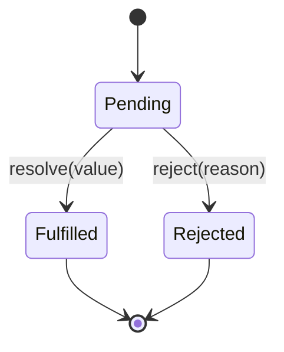

# JavaScript Promises

## Introduction

A Promise represents the eventual result of an asynchronous operation. It is an object that holds a future value — either a resolved value or a rejection reason.

---

## Promise States



Once a promise settles (fulfills or rejects), it never changes state again.

---

## Creating and Consuming Promises

```javascript
// Creating
const promise = new Promise((resolve, reject) => {
  setTimeout(() => {
    if (Math.random() > 0.5) {
      resolve({ data: 'success' });
    } else {
      reject(new Error('Something went wrong'));
    }
  }, 1000);
});

// Consuming
promise
  .then(result => console.log(result.data))
  .catch(error => console.error(error.message))
  .finally(() => console.log('Settled'));
```

---

## Promise Combinators

```javascript
// All — succeeds if all resolve, fails if any reject
const [user, posts, comments] = await Promise.all([
  fetchUser(id),
  fetchPosts(id),
  fetchComments(id),
]);

// AllSettled — never rejects, returns status of all
const results = await Promise.allSettled([
  fetchUser(id),
  fetchOptionalData(),
]);
results.forEach(result => {
  if (result.status === 'fulfilled') use(result.value);
  if (result.status === 'rejected') log(result.reason);
});

// Race — first to settle wins
const firstResult = await Promise.race([
  fetch('/api/primary'),
  fetch('/api/fallback'),
]);

// Any — first to resolve wins (rejects if all reject)
const fastest = await Promise.any([
  fetch('/cdn1/resource'),
  fetch('/cdn2/resource'),
]);
```

---

## Angular Pattern — Promise vs Observable

```typescript
// Observable (preferred in Angular)
this.http.get<User[]>('/api/users').subscribe(users => ...);

// Convert to Promise when needed
const users = await firstValueFrom(this.http.get<User[]>('/api/users'));
```

---

## Related Topics

- **Previous:** [Closures](./closures)
- **Next:** [Async/Await](./async-await)
- **Related:** [RxJS Introduction](/docs/rxjs/introduction)
