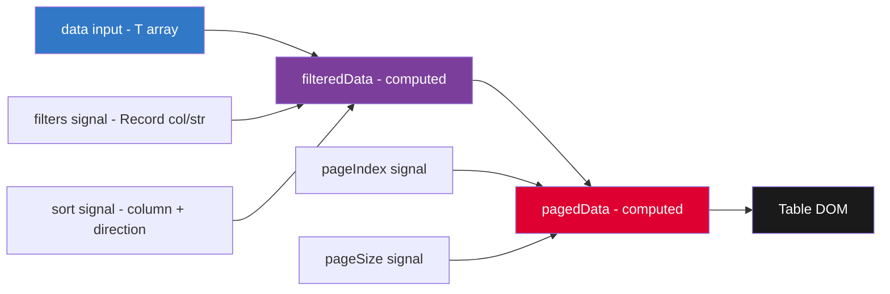

# Build a Data Grid

## 30-Second Answer

A data grid is a **generic computed-signal pipeline**: raw `data` input → filter → sort → paginate, all as `computed()` signals. Sorting state is `{ column, direction }` — both plain signals. Filtering state is `Record<string, string>`. When either changes, `filteredData` recomputes automatically, and `pagedData` derives from that. Reset `pageIndex` to 0 whenever sort or filter changes. Use `role="table"`, `aria-sort` on `<th>`, and `aria-busy` on the table during loading.

---

## Data Flow Architecture



---

## Problem Statement

Build a data grid component that:
- Displays tabular data with custom columns
- Supports column sorting (asc/desc/none)
- Supports per-column filtering
- Paginates results (10/25/50 per page)
- Shows loading and empty states
- (Bonus) Virtual scrolling for large datasets

---

## Types

```typescript
export interface GridColumn<T> {
  key: keyof T;
  label: string;
  sortable?: boolean;
  filterable?: boolean;
  width?: string;
  render?: (value: T[keyof T], row: T) => string;
}

export interface SortState {
  column: string | null;
  direction: 'asc' | 'desc' | null;
}

export interface GridState<T> {
  data: T[];
  columns: GridColumn<T>[];
  sort: SortState;
  filters: Record<string, string>;
  pageIndex: number;
  pageSize: number;
  loading: boolean;
  error: string | null;
}
```

---

## Data Grid Service

```typescript
@Component({
  selector: 'app-data-grid',
  standalone: true,
  changeDetection: ChangeDetectionStrategy.OnPush,
  template: `
    <div class="grid-container" role="region" aria-label="Data table">
      <div class="grid-toolbar">
        <app-grid-filters [columns]="filterableColumns()" (filterChanged)="onFilter($event)" />
        <app-column-visibility [columns]="columns()" />
      </div>

      <table role="table" aria-busy="loading()">
        <thead>
          <tr>
            @for (col of visibleColumns(); track col.key) {
              <th
                [attr.aria-sort]="ariaSort(col.key)"
                (click)="col.sortable && onSort(col.key)"
                [class.sortable]="col.sortable"
              >
                {{ col.label }}
                @if (col.sortable) {
                  <span class="sort-icon" aria-hidden="true">
                    {{ getSortIcon(col.key) }}
                  </span>
                }
              </th>
            }
          </tr>
          @for (col of visibleColumns(); track col.key) {
            @if (col.filterable) {
              <td><input [placeholder]="'Filter ' + col.label"
                         (input)="onColumnFilter(col.key, $event)" /></td>
            }
          }
        </thead>
        <tbody>
          @if (loading()) {
            <tr><td [attr.colspan]="visibleColumns().length">
              <app-skeleton-rows [count]="pageSize()" />
            </td></tr>
          } @else if (pagedData().length === 0) {
            <tr><td [attr.colspan]="visibleColumns().length" class="empty-state">
              No results found.
            </td></tr>
          } @else {
            @for (row of pagedData(); track row.id) {
              <tr>
                @for (col of visibleColumns(); track col.key) {
                  <td>{{ renderCell(col, row) }}</td>
                }
              </tr>
            }
          }
        </tbody>
      </table>

      <app-pagination
        [total]="filteredData().length"
        [pageIndex]="pageIndex()"
        [pageSize]="pageSize()"
        (pageChanged)="onPageChange($event)"
      />
    </div>
  `,
})
export class DataGridComponent<T extends { id: string }> {
  columns = input.required<GridColumn<T>[]>();
  data = input.required<T[]>();
  loading = input(false);

  private readonly _sort = signal<SortState>({ column: null, direction: null });
  private readonly _filters = signal<Record<string, string>>({});
  private readonly _pageIndex = signal(0);
  private readonly _pageSize = signal(25);
  readonly pageIndex = this._pageIndex.asReadonly();
  readonly pageSize = this._pageSize.asReadonly();

  readonly filteredData = computed(() => {
    let result = this.data();
    const filters = this._filters();

    // Apply column filters
    for (const [key, value] of Object.entries(filters)) {
      if (!value) continue;
      result = result.filter(row =>
        String(row[key as keyof T]).toLowerCase().includes(value.toLowerCase())
      );
    }

    // Apply sort
    const { column, direction } = this._sort();
    if (column && direction) {
      result = [...result].sort((a, b) => {
        const aVal = String(a[column as keyof T]);
        const bVal = String(b[column as keyof T]);
        const cmp = aVal.localeCompare(bVal);
        return direction === 'asc' ? cmp : -cmp;
      });
    }

    return result;
  });

  readonly pagedData = computed(() => {
    const start = this._pageIndex() * this._pageSize();
    return this.filteredData().slice(start, start + this._pageSize());
  });

  onSort(key: string): void {
    this._sort.update(s => {
      if (s.column !== key) return { column: key, direction: 'asc' };
      if (s.direction === 'asc') return { column: key, direction: 'desc' };
      return { column: null, direction: null };
    });
    this._pageIndex.set(0); // reset to first page on sort
  }

  onColumnFilter(key: string | number | symbol, event: Event): void {
    const value = (event.target as HTMLInputElement).value;
    this._filters.update(f => ({ ...f, [String(key)]: value }));
    this._pageIndex.set(0);
  }

  onPageChange(index: number): void {
    this._pageIndex.set(index);
  }

  ariaSort(key: string | number | symbol): 'ascending' | 'descending' | 'none' | undefined {
    const s = this._sort();
    if (s.column !== key) return 'none';
    return s.direction === 'asc' ? 'ascending' : 'descending';
  }
}
```

---

## Interview Points

- **Computed signals** — filtering and sorting are derived state, not imperative
- **Accessibility** — `aria-sort` on columns, `role="table"`, `aria-busy` on loading
- **Generics** — `DataGridComponent<T>` works with any data shape
- **Pagination reset** — always reset to page 0 when filters or sort change
- **Virtual scrolling** — for >10k rows, switch to `CdkVirtualScrollViewport`

---

## Accessibility Checklist

- Table semantics: `<table>`, `<thead>`, `<tbody>`, `<th scope="col">` — no `role="table"` needed when using native elements
- Sort state: `aria-sort="ascending"` / `"descending"` / `"none"` on `<th>` for sortable columns
- Loading: `aria-busy="true"` on `<table>` while data loads; announce row count change with `aria-live="polite"`
- Empty state: put empty message inside a `<td colspan>` — screenreader reads it in table context
- Filter inputs: each filter `<input>` needs `aria-label="Filter by {column name}"` — placeholder alone is not accessible
- Pagination: buttons need descriptive labels: "Next page", "Previous page", "Page 3 of 10"
- Row count: announce "Showing 26–50 of 200 results" in a `<caption>` or `aria-live` region
- Keyboard: full table navigation with Tab (focusable cells), no mouse-only interactions

---

## Official References

- [MDN — `<table>`: The Table element](https://developer.mozilla.org/en-US/docs/Web/HTML/Reference/Elements/table)
- [ARIA Grid Pattern — W3C APG](https://www.w3.org/WAI/ARIA/apg/patterns/grid/)
- [Angular CDK — Virtual Scroll](https://material.angular.io/cdk/scrolling/overview)
- [Angular Signals — angular.dev](https://angular.dev/guide/signals)

---

## Related Topics

- **Previous:** [Tree View](./tree-view)
- **Next:** [Interview Questions](./interview-questions)
