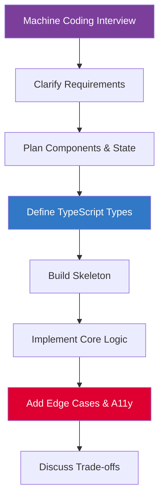

# Machine Coding

## Introduction

Machine coding rounds ask you to build a functional UI component or small application in 60–90 minutes with a live interviewer watching. The problems are open-ended: "Build a Kanban board", "Implement a tree view", "Create a data grid with sorting and filtering."

You are evaluated not just on whether it works, but on **code quality**, **component design**, **state management**, and **how you handle edge cases**.

---

## The Approach Framework

```
1. Clarify (5 min)     → requirements, constraints, what counts as done
2. Plan (5 min)        → components, state, interfaces, data flow
3. Build skeleton (10 min) → types, component structure, routing
4. Implement core (40 min) → logic, template, styling
5. Polish (10 min)     → edge cases, accessibility, error states
6. Discuss (5 min)     → trade-offs, what you'd do differently
```

Never start coding without clarifying and planning. Interviewers value structured thinking over fast typing.

---

## TypeScript-First

Define your types first — they drive everything else:

```typescript
// Kanban example
interface Column {
  id: string;
  title: string;
  cardIds: string[];
}

interface Card {
  id: string;
  title: string;
  description: string;
  priority: 'low' | 'medium' | 'high';
  assigneeId: string | null;
}

interface BoardState {
  columns: Record<string, Column>;
  cards: Record<string, Card>;
  columnOrder: string[];
}
```

---

## Problems in This Section

| Problem | Key Concepts |
|---|---|
| [Kanban Board](./kanban-board) | Drag and drop, optimistic updates, state normalization |
| [Tree View](./tree-view) | Recursive components, expand/collapse, lazy loading |
| [Data Grid](./data-grid) | Virtual scrolling, sorting, filtering, pagination |

---

## What Interviewers Look For

- Clean TypeScript interfaces
- Proper component decomposition (smart/dumb)
- Reactive state with signals or RxJS
- `track` function on `@for` loops
- Accessibility — keyboard navigation, ARIA
- Error and loading states
- No memory leaks (unsubscribed observables)

---

## Architecture Overview



---

## Related Topics

- **Next:** [Kanban Board](./kanban-board)
- **Related:** [Frontend System Design](/docs/frontend-system-design/introduction)
- **Related:** [Angular Signals](/docs/angular/signals)
- **Related:** [TypeScript Introduction](/docs/typescript/introduction)