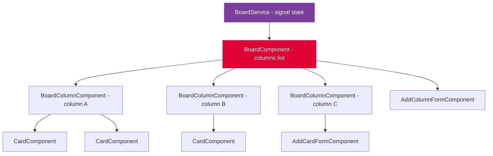

# Build a Kanban Board

## 30-Second Answer

A Kanban board is a **signal-driven, normalized state** component tree. Store all columns and cards in `Record<id, entity>` maps for O(1) lookups. Each column is a `BoardColumnComponent` that only renders when its card IDs change (OnPush). Move a card by removing its ID from one column's `cardIds` array and appending it to another — a pure state update with no DOM manipulation. Persist to `localStorage` on every mutation.

---

## Component Architecture



---

## Problem Statement

Build a Kanban board with:
- Multiple columns (Todo, In Progress, Done)
- Cards that can be moved between columns
- Add/edit/delete cards
- Add/rename/delete columns
- Drag and drop (bonus)

---

## Types

```typescript
// board.model.ts
export interface Card {
  id: string;
  title: string;
  description?: string;
  priority: 'low' | 'medium' | 'high';
  assignee?: string;
  createdAt: Date;
}

export interface Column {
  id: string;
  title: string;
  cardIds: string[];
  limit?: number; // WIP limit
}

export interface BoardState {
  id: string;
  title: string;
  columns: Record<string, Column>;
  cards: Record<string, Card>;
  columnOrder: string[];
}
```

---

## Service with Signal State

```typescript
@Injectable({ providedIn: 'root' })
export class BoardService {
  private readonly _state = signal<BoardState>(this.loadOrDefault());

  readonly state = this._state.asReadonly();
  readonly columns = computed(() =>
    this._state().columnOrder.map(id => this._state().columns[id])
  );
  readonly cardsByColumn = (columnId: string) =>
    computed(() =>
      this._state().columns[columnId]?.cardIds
        .map(id => this._state().cards[id])
        .filter(Boolean) ?? []
    );

  addCard(columnId: string, title: string): void {
    const id = crypto.randomUUID();
    this._state.update(s => ({
      ...s,
      cards: {
        ...s.cards,
        [id]: { id, title, priority: 'medium', createdAt: new Date() },
      },
      columns: {
        ...s.columns,
        [columnId]: {
          ...s.columns[columnId],
          cardIds: [...s.columns[columnId].cardIds, id],
        },
      },
    }));
    this.persist();
  }

  moveCard(cardId: string, fromColumnId: string, toColumnId: string): void {
    this._state.update(s => ({
      ...s,
      columns: {
        ...s.columns,
        [fromColumnId]: {
          ...s.columns[fromColumnId],
          cardIds: s.columns[fromColumnId].cardIds.filter(id => id !== cardId),
        },
        [toColumnId]: {
          ...s.columns[toColumnId],
          cardIds: [...s.columns[toColumnId].cardIds, cardId],
        },
      },
    }));
    this.persist();
  }

  private persist(): void {
    localStorage.setItem('board', JSON.stringify(this._state()));
  }

  private loadOrDefault(): BoardState {
    try {
      const saved = localStorage.getItem('board');
      if (saved) return JSON.parse(saved);
    } catch {}
    return getDefaultBoard();
  }
}
```

---

## Board Component

```typescript
@Component({
  selector: 'app-board',
  standalone: true,
  imports: [BoardColumnComponent, AddColumnFormComponent],
  changeDetection: ChangeDetectionStrategy.OnPush,
  template: `
    <div class="board">
      @for (column of boardService.columns(); track column.id) {
        <app-board-column
          [column]="column"
          [cards]="boardService.cardsByColumn(column.id)()"
          (cardMoved)="onCardMoved($event)"
          (cardAdded)="onCardAdded($event)"
          (cardDeleted)="onCardDeleted($event)"
        />
      }
      <app-add-column-form (columnAdded)="onColumnAdded($event)" />
    </div>
  `,
  styles: [`
    .board {
      display: flex;
      gap: 1rem;
      padding: 1.5rem;
      overflow-x: auto;
      min-height: 100vh;
      align-items: flex-start;
    }
  `],
})
export class BoardComponent {
  readonly boardService = inject(BoardService);

  onCardAdded(e: { columnId: string; title: string }) {
    this.boardService.addCard(e.columnId, e.title);
  }

  onCardMoved(e: { cardId: string; from: string; to: string }) {
    this.boardService.moveCard(e.cardId, e.from, e.to);
  }

  onCardDeleted(e: { cardId: string; columnId: string }) {
    this.boardService.deleteCard(e.cardId, e.columnId);
  }

  onColumnAdded(title: string) {
    this.boardService.addColumn(title);
  }
}
```

---

## Interview Points to Mention

- **Normalized state** — `Record<id, entity>` prevents O(n) lookups
- **OnPush everywhere** — each column only re-renders when its cards change
- **Immutable updates** — spread operator prevents mutation
- **LocalStorage persistence** — survives page refresh
- **Accessibility** — keyboard-navigable cards, ARIA labels on column regions

---

## Exercises

1. Extend the board to support WIP limits — columns should visually warn when `cardIds.length >= column.limit` and prevent adding more cards with an accessible error message.
2. Add a card priority filter signal — a computed that returns only cards of a given priority across all columns.
3. Implement undo/redo by keeping a history stack of `BoardState[]` — `Ctrl+Z` restores the previous snapshot.

---

## Accessibility Checklist

- Column regions: `role="region"` with `aria-label="Todo column (3 cards)"`
- Cards: `role="article"` or `role="listitem"`, focusable via `tabindex="0"`
- Drag and drop: provide a keyboard alternative — select card with Enter, use arrow keys to move to another column, confirm with Enter
- Announce moves: use an `aria-live="polite"` region to say "Card X moved to Done column"
- Priority badge: `aria-label="Priority: high"` — don't rely on color alone
- Add card button: `aria-label="Add card to Todo"` not just "Add"
- Empty column: `aria-label="In Progress column, empty"`
- WIP limit exceeded: `aria-live="assertive"` alert announcing the violation

---

## Official References

- [Angular CDK Drag and Drop](https://material.angular.io/cdk/drag-drop/overview)
- [ARIA Listbox Pattern — W3C](https://www.w3.org/WAI/ARIA/apg/patterns/listbox/)
- [MDN — Drag and Drop API](https://developer.mozilla.org/en-US/docs/Web/API/HTML_Drag_and_Drop_API)
- [Angular Signals — angular.dev](https://angular.dev/guide/signals)

---

## Related Topics

- **Previous:** [Approach Framework](./approach-framework)
- **Next:** [Tree View](./tree-view)
