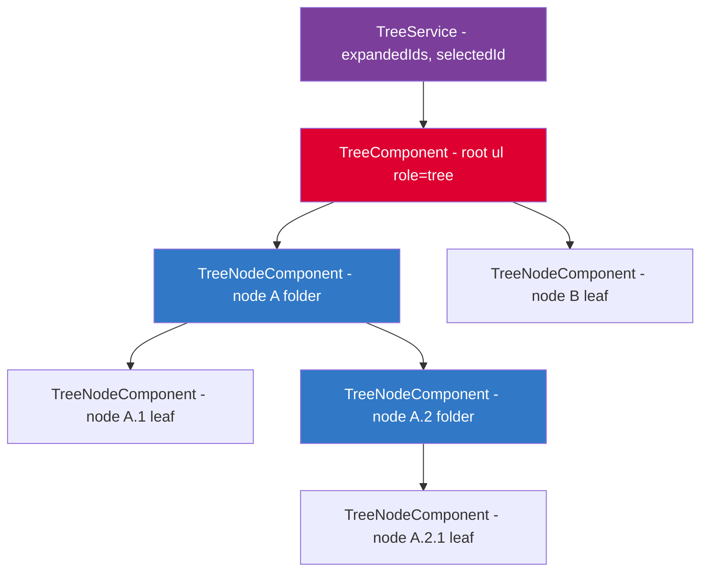

# Build a Tree View

## 30-Second Answer

A tree view is a **recursive component** where `TreeNodeComponent` imports itself to render children. State lives in a `TreeService` with two signals: `expandedIds` (a `Set<string>`) and `selectedId`. Toggle expansion by cloning the set and adding/deleting the ID — Angular detects the new reference and re-renders. Keyboard navigation follows the ARIA tree pattern: `ArrowRight` expands, `ArrowLeft` collapses, `ArrowDown`/`Up` moves focus. Use `role="tree"` on the root `<ul>` and `role="treeitem"` on each `<li>`.

---

## Component Architecture



---

## Problem Statement

Build a tree view component that:
- Displays hierarchical data (files, categories, org chart)
- Supports expand/collapse of nodes
- Shows icons for folders vs files
- Supports keyboard navigation (arrows to expand/collapse/navigate)
- Handles large trees with lazy loading

---

## Types

```typescript
export interface TreeNode {
  id: string;
  label: string;
  icon?: string;
  children?: TreeNode[];
  isLeaf?: boolean;
  isLoading?: boolean;
  data?: unknown; // arbitrary payload
}

export interface TreeState {
  expandedIds: Set<string>;
  selectedId: string | null;
  focusedId: string | null;
}
```

---

## Tree Service

```typescript
@Injectable({ providedIn: 'root' })
export class TreeService {
  private readonly _expanded = signal<Set<string>>(new Set());
  private readonly _selected = signal<string | null>(null);

  readonly expanded = this._expanded.asReadonly();
  readonly selected = this._selected.asReadonly();

  isExpanded(id: string): boolean {
    return this._expanded().has(id);
  }

  toggle(id: string): void {
    this._expanded.update(set => {
      const next = new Set(set);
      if (next.has(id)) next.delete(id);
      else next.add(id);
      return next;
    });
  }

  select(id: string): void {
    this._selected.set(id);
  }

  expandAll(nodes: TreeNode[]): void {
    const allIds = this.getAllIds(nodes);
    this._expanded.set(new Set(allIds));
  }

  private getAllIds(nodes: TreeNode[]): string[] {
    return nodes.flatMap(n => [
      n.id,
      ...(n.children ? this.getAllIds(n.children) : []),
    ]);
  }
}
```

---

## Recursive Component

```typescript
@Component({
  selector: 'app-tree-node',
  standalone: true,
  imports: [TreeNodeComponent], // self-reference for recursion
  changeDetection: ChangeDetectionStrategy.OnPush,
  template: `
    <li
      [class.selected]="treeService.selected() === node().id"
      role="treeitem"
      [attr.aria-expanded]="hasChildren() ? isExpanded() : null"
      [attr.aria-selected]="treeService.selected() === node().id"
      [tabindex]="0"
      (click)="handleClick()"
      (keydown)="handleKeydown($event)"
    >
      <div class="node-row">
        @if (hasChildren()) {
          <button
            class="toggle"
            [attr.aria-label]="isExpanded() ? 'Collapse' : 'Expand'"
            (click)="$event.stopPropagation(); treeService.toggle(node().id)"
          >
            {{ isExpanded() ? '▾' : '▸' }}
          </button>
        } @else {
          <span class="toggle-spacer"></span>
        }
        <span class="node-label">{{ node().label }}</span>
      </div>

      @if (hasChildren() && isExpanded()) {
        <ul role="group">
          @for (child of node().children!; track child.id) {
            <app-tree-node [node]="child" />
          }
        </ul>
      }
    </li>
  `,
})
export class TreeNodeComponent {
  node = input.required<TreeNode>();
  readonly treeService = inject(TreeService);

  hasChildren = computed(() => (this.node().children?.length ?? 0) > 0);
  isExpanded = computed(() => this.treeService.isExpanded(this.node().id));

  handleClick(): void {
    this.treeService.select(this.node().id);
    if (this.hasChildren()) this.treeService.toggle(this.node().id);
  }

  handleKeydown(event: KeyboardEvent): void {
    switch (event.key) {
      case 'Enter':
      case ' ':
        event.preventDefault();
        this.handleClick();
        break;
      case 'ArrowRight':
        event.preventDefault();
        if (this.hasChildren() && !this.isExpanded()) {
          this.treeService.toggle(this.node().id);
        }
        break;
      case 'ArrowLeft':
        event.preventDefault();
        if (this.isExpanded()) {
          this.treeService.toggle(this.node().id);
        }
        break;
    }
  }
}
```

---

## Interview Points

- **Recursion** — component imports itself for nested rendering
- **OnPush** — each node only re-renders when its inputs change
- **ARIA tree pattern** — `role="tree"`, `role="treeitem"`, `aria-expanded`, `aria-selected`
- **Keyboard** — Arrow keys, Enter, Space per ARIA authoring practices
- **Performance** — CDK virtual scrolling for flat virtual tree if > 1000 nodes

---

## Exercises

1. Add lazy loading — when a folder node is expanded for the first time, simulate an async fetch for its children with a 500ms delay and show a spinner inside the node during loading.
2. Implement a search/filter function that flattens the tree to show only nodes matching a query string, with their ancestors expanded automatically.
3. Add drag-and-drop reordering within a parent node using the HTML Drag and Drop API — update the children array in `TreeService` when a node is dropped.

---

## Accessibility Checklist

- Root list: `role="tree"` with `aria-label="File explorer"`
- Each node: `role="treeitem"`, `aria-expanded="true/false"` on folders (omit on leaves), `aria-selected`
- Keyboard: `ArrowDown`/`Up` navigates between visible nodes, `ArrowRight` expands/enters, `ArrowLeft` collapses/goes to parent, `Home`/`End` jump to first/last visible
- Focus management: maintain a single `tabindex="0"` on the currently focused node; all others `tabindex="-1"` (roving tabindex pattern)
- Selection announcement: `aria-live="polite"` region says "Selected: \{node label\}"
- Loading state: `aria-busy="true"` on the node while children load lazily
- Icons: decorative icons get `aria-hidden="true"`; meaningful state icons (e.g., modified file) get `aria-label`

---

## Official References

- [ARIA Tree View Pattern — W3C APG](https://www.w3.org/WAI/ARIA/apg/patterns/treeview/)
- [MDN — TreeView ARIA example](https://developer.mozilla.org/en-US/docs/Web/Accessibility/ARIA/Roles/tree_role)
- [Angular CDK — Virtual Scroll](https://material.angular.io/cdk/scrolling/overview)
- [Angular Signals — angular.dev](https://angular.dev/guide/signals)

---

## Related Topics

- **Previous:** [Kanban Board](./kanban-board)
- **Next:** [Data Grid](./data-grid)
