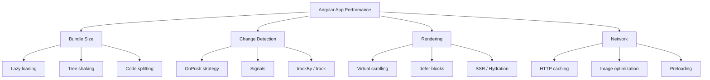

# Frontend Performance

## Introduction

Performance is a feature. A one-second delay in page load reduces conversions by 7%. For enterprise Angular apps, performance improvements directly translate to business value.

Modern performance is measured by **Core Web Vitals** — Google's metrics for user experience: loading, interactivity, and visual stability.

---

## Core Web Vitals

| Metric | Measures | Good | Needs Improvement |
|---|---|---|---|
| **LCP** (Largest Contentful Paint) | Loading | ≤ 2.5s | 2.5s–4s |
| **INP** (Interaction to Next Paint) | Interactivity | ≤ 200ms | 200ms–500ms |
| **CLS** (Cumulative Layout Shift) | Visual stability | ≤ 0.1 | 0.1–0.25 |

---

## Angular-Specific Performance

---

## What to Study Next

| Chapter | Impact |
|---|---|
| [Core Web Vitals](./core-web-vitals) | Measure and improve LCP, INP, CLS |
| [Angular Performance](./angular-performance) | OnPush, signals, track, defer |
| [Bundle Optimization](./network-optimization) | Lazy loading, code splitting |
| [Image Optimization](./image-optimization) | NgOptimizedImage, WebP, lazy loading |
| [Caching](./caching) | HTTP cache, service workers |

---

## Official References

- [web.dev Performance](https://web.dev/performance)
- [Angular Performance Guide](https://angular.dev/best-practices/runtime-performance)
- [Chrome DevTools Performance Panel](https://developer.chrome.com/docs/devtools/performance/)

---

## Related Topics

- **Related:** [Browser Internals](/docs/browser/introduction)
- **Related:** [Angular Change Detection](/docs/angular/change-detection)
