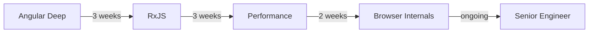

# Angular Professional Path

## Who this is for

Working Angular developers who want to move from mid-level to senior. You can build Angular applications but you want to understand the deeper internals, write more performant code, and speak confidently in technical interviews.

---

## Path Overview

---

## Step 1 — Angular Deep Dive (3 weeks)

**Goal:** Understand Angular's internals, not just its APIs.

Topics:
- Signals and reactive primitives
- Standalone components and lazy loading
- Change detection — Default vs OnPush
- Angular's dependency injection tree
- Routing guards, resolvers, lazy loading
- Reactive forms and custom validators

**Exit criteria:** Refactor a components-based app to use signals. Achieve zero unnecessary renders.

---

## Step 2 — RxJS (3 weeks)

**Goal:** Write reactive data flows without confusion.

Topics:
- Observable contract and cold vs hot
- Key operators: `switchMap`, `mergeMap`, `concatMap`, `exhaustMap`
- Error handling: `catchError`, `retry`, `retryWhen`
- Subject types: `Subject`, `BehaviorSubject`, `ReplaySubject`
- Angular patterns: smart/dumb components, `async` pipe

**Exit criteria:** Build a type-ahead search with debounce, cancellation, and error recovery using RxJS.

---

## Step 3 — Performance (2 weeks)

**Goal:** Build Angular apps that score 95+ on Lighthouse.

Topics:
- Core Web Vitals — LCP, FID/INP, CLS
- Change detection optimization
- Bundle analysis with `webpack-bundle-analyzer`
- Lazy loading modules and standalone routes
- Image optimization and `NgOptimizedImage`
- Server-Side Rendering with Angular SSR

**Exit criteria:** Take an Angular app from Lighthouse score 60 to 90+.

---

## Step 4 — Browser Internals (2 weeks)

**Goal:** Know what happens at the browser level when Angular runs.

Topics:
- The rendering pipeline — parse, layout, paint, composite
- The JavaScript event loop and the task/microtask queue
- Memory management and leak detection
- Network waterfall analysis

**Exit criteria:** Profile an Angular app in Chrome DevTools and identify the main render bottleneck.

---

## Related Topics

- [Senior Interview Path](./senior-interview-path)
- [Angular Introduction](/docs/angular/introduction)
- [RxJS Introduction](/docs/rxjs/introduction)
