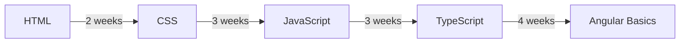

# Beginner Path

## Who this is for

Developers new to frontend engineering or coming from a different programming background. You understand the basics of programming but need a structured path to becoming a working Angular developer.

---

## Path Overview

---

## Step 1 — HTML (2 weeks)

**Goal:** Understand how browsers interpret documents.

Topics:
- Document structure and DOCTYPE
- Semantic elements (`<article>`, `<section>`, `<nav>`, `<main>`)
- Forms and input types
- Accessibility basics (`aria-*`, roles)
- Images and media

**Exit criteria:** Build a semantic HTML form page that passes accessibility checks.

---

## Step 2 — CSS (3 weeks)

**Goal:** Layout any design in a browser.

Topics:
- Box model, display, positioning
- Flexbox — align and distribute items
- CSS Grid — two-dimensional layouts
- Responsive design and media queries
- Custom properties (CSS variables)

**Exit criteria:** Build a responsive dashboard layout that works on mobile and desktop.

---

## Step 3 — JavaScript (3 weeks)

**Goal:** Understand the language deeply enough to avoid common bugs.

Topics:
- Variables, scope, closures
- Arrays, objects, destructuring
- Functions, arrow functions, `this`
- Promises and async/await
- DOM manipulation

**Exit criteria:** Build an interactive to-do list with localStorage persistence.

---

## Step 4 — TypeScript (3 weeks)

**Goal:** Add type safety to every project you write.

Topics:
- Basic types and type inference
- Interfaces and type aliases
- Generics
- `strict` mode

**Exit criteria:** Convert a JavaScript project to TypeScript with zero `any` types.

---

## Step 5 — Angular Basics (4 weeks)

**Goal:** Build your first Angular application.

Topics:
- Angular CLI and project structure
- Components, templates, data binding
- Directives and pipes
- Services and dependency injection
- Basic routing

**Exit criteria:** Build a multi-route Angular application with a list view and detail view.

---

## Suggested Daily Schedule

| Day | Activity |
|---|---|
| Weekdays | 1–2 hours reading + coding |
| Weekend | Build a small project applying the week's learning |

---

## Related Topics

- [Angular Professional Path](./angular-professional-path)
- [HTML Introduction](/docs/html/introduction)
- [JavaScript Introduction](/docs/javascript/introduction)
---

## Related Topics

- **Previous:** [Roadmap Overview](./overview)
- **Next:** [Angular Professional Path](./angular-professional-path)
- **Related:** [HTML Introduction](/docs/html/introduction)