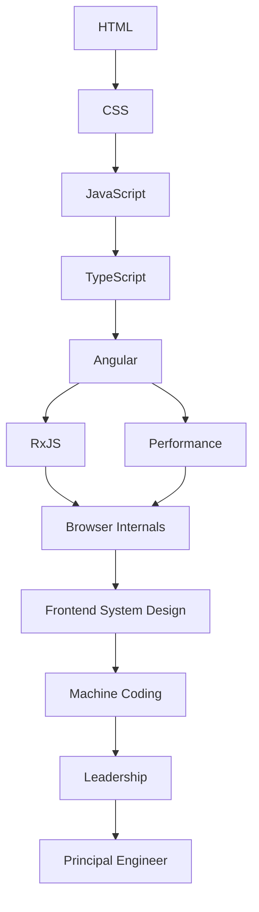

# Learning Roadmap

## Introduction

This roadmap maps every skill a modern frontend engineer needs — from semantic HTML to Principal-level system design. It is opinionated, Angular-first, and interview-focused.

Use it as a north star. Return to it regularly to know where you are and what comes next.

---

## Why a structured roadmap?

Frontend engineering has grown from writing jQuery to architecting scalable SPAs with signals, reactive streams, and micro-frontends. Without a map, engineers learn randomly — strong in some areas, critically weak in others.

A roadmap gives you:
- **Clarity** on what to learn next
- **Confidence** that you have no critical gaps
- **Direction** when studying for senior or Principal roles

---

## The Three Paths

### Path A — Beginner

For developers new to frontend or Angular.

```
HTML → CSS → JavaScript → TypeScript → Angular Basics
```

Time estimate: 3–6 months with daily practice.

### Path B — Angular Professional

For working Angular developers aiming for Senior.

```
Angular (Deep) → RxJS → Performance → Browser Internals
```

Time estimate: 2–4 months.

### Path C — Senior Interview Preparation

For developers targeting Senior/Principal roles at product companies.

```
JavaScript Internals → Angular Internals → Performance → 
Frontend System Design → Machine Coding → Leadership
```

Time estimate: 2–3 months of focused preparation.

---

## Topic Map



---

## What each section covers

| Section | Key Topics | Target Level |
|---|---|---|
| HTML | Semantics, accessibility, forms, APIs | Beginner |
| CSS | Flexbox, Grid, animations, responsive | Beginner |
| JavaScript | Closures, event loop, async, modules | Beginner → Advanced |
| TypeScript | Types, generics, decorators, strict mode | Intermediate |
| Angular | Components, signals, routing, forms | Intermediate → Advanced |
| RxJS | Observables, operators, patterns | Intermediate → Advanced |
| Browser Internals | Rendering, memory, security | Advanced |
| Performance | CWV, lazy loading, optimization | Advanced |
| System Design | Architecture, trade-offs at scale | Senior |
| Machine Coding | Live problem solving | Senior |
| Leadership | Technical communication, architecture | Principal |

---

## How to use this guide

1. **Start at your level** — don't start at HTML if you already know JavaScript
2. **Read the introduction** of each chapter before diving into details
3. **Attempt exercises** before reading answers
4. **Study interview questions** before each topic interview
5. **Cross-link** — use the "Related Topics" section on each page

---

## Official References

- [Angular Documentation](https://angular.dev)
- [MDN Web Docs](https://developer.mozilla.org)
- [TypeScript Handbook](https://www.typescriptlang.org/docs/)
- [web.dev](https://web.dev)
- [ECMAScript Specification](https://tc39.es/ecma262/)
---

## Related Topics

- **Next:** [Beginner Path](./beginner-path)
- **Related:** [HTML Introduction](/docs/html/introduction)