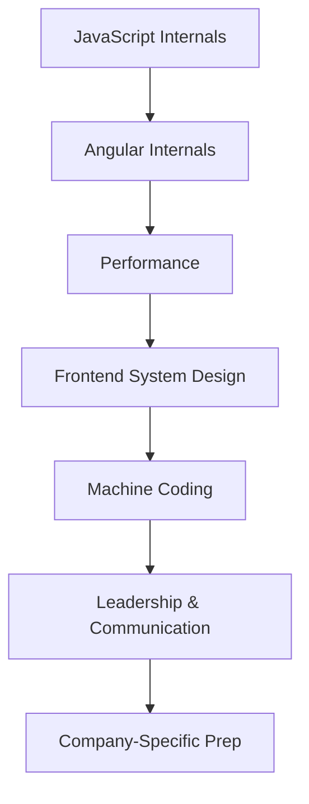

# Senior Interview Path

## Who this is for

Experienced developers with 4+ years of frontend experience preparing for Senior or Principal Engineer interviews at top product companies. You know Angular well — now you need to demonstrate depth, system thinking, and leadership.

---

## Path Overview

---

## Interview Round Types

| Round | Focus | Chapters |
|---|---|---|
| Coding | DSA, problem solving | JavaScript, TypeScript |
| Front-end Coding | DOM, components, patterns | JavaScript, Angular |
| Machine Coding | Build a UI feature live | Machine Coding |
| System Design | Architecture trade-offs | Frontend System Design |
| Technical Deep Dive | Internals, debugging | Browser, Performance, Angular |
| Behavioral | Leadership, conflict, impact | Leadership |

---

## 8-Week Study Plan

### Weeks 1–2: JavaScript & TypeScript Internals
- Event loop, task queue, microtask queue
- Closures, scope chain, prototype chain
- `this` binding rules
- TypeScript generics and utility types
- ES2020–2025 features

### Weeks 3–4: Angular Internals
- Change detection with Zone.js vs Signals
- Dependency injection architecture
- Standalone component compilation
- Router internals and navigation lifecycle
- Angular performance profiling

### Weeks 5–6: System Design & Performance
- Design a dashboard (think Grafana, analytics)
- Design a chat application
- Design a file upload component
- Core Web Vitals and optimization strategies
- Network performance and caching

### Weeks 7–8: Machine Coding + Company Prep
- Kanban board from scratch
- Tree view with virtual scrolling
- Data grid with sorting, filtering, pagination
- Company-specific question banks

---

## Key Interview Topics by Company

| Company | Primary Focus |
|---|---|
| JPMorgan | Performance, security, TypeScript |
| Microsoft | System design, accessibility, Angular |
| Adobe | Component APIs, design systems |
| Flipkart | Machine coding, React/Angular |
| Oracle | Java + Angular, enterprise patterns |

---

## Related Topics

- [Angular Professional Path](./angular-professional-path)
- [Company Guides](/docs/company-guides/overview)
- [Frontend System Design](/docs/frontend-system-design/introduction)
- [Machine Coding](/docs/machine-coding/introduction)
---

## Related Topics

- **Previous:** [Angular Professional Path](./angular-professional-path)
- **Related:** [Company Guides](/docs/company-guides/overview)
- **Related:** [Frontend System Design](/docs/frontend-system-design/introduction)