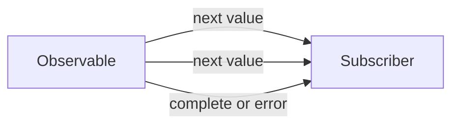

# RxJS Introduction

## Introduction

RxJS (Reactive Extensions for JavaScript) is a library for composing asynchronous and event-based programs using observable sequences. It models any data source — HTTP responses, user events, timers, WebSockets — as a stream that can be transformed, combined, and observed.

Angular's `HttpClient`, `Router`, `Forms`, and `AsyncPipe` all return or work with RxJS Observables.

---

## Why it matters

RxJS solves a class of problems that Promises cannot:
- **Multiple values over time** — a search input emitting new queries as the user types
- **Cancellation** — `switchMap` cancels the previous HTTP request when a new one starts
- **Composition** — chain `debounceTime`, `distinctUntilChanged`, `switchMap` declaratively
- **Retry logic** — `retry(3)`, `retryWhen()` with exponential backoff
- **Combining streams** — `combineLatest`, `forkJoin`, `merge` for multiple data sources

---

## The Observable Contract

An Observable emits zero or more values, then either **completes** or **errors**. Once it completes or errors, it emits nothing more.



```typescript
import { Observable } from 'rxjs';

// Creating an observable manually
const numbers$ = new Observable<number>(subscriber => {
  subscriber.next(1);
  subscriber.next(2);
  subscriber.next(3);
  subscriber.complete();
});

// Subscribing
numbers$.subscribe({
  next: value => console.log(value),     // 1, 2, 3
  error: err => console.error(err),
  complete: () => console.log('done'),   // done
});
```

---

## Cold vs Hot Observables

```typescript
// Cold observable — starts fresh for each subscriber
const cold$ = this.http.get('/api/users'); // new HTTP request per subscription

// Hot observable — shares a single source
const subject = new Subject<string>();
const hot$ = subject.asObservable(); // all subscribers see the same emissions
```

- **Cold** — HTTP requests, `of()`, `from()`, `timer()` — each subscriber gets its own execution
- **Hot** — DOM events, WebSockets, Subjects — subscribers share the same source

---

## Creation Operators

```typescript
import { of, from, interval, timer, fromEvent, EMPTY, NEVER } from 'rxjs';

of(1, 2, 3)                     // emits 1, 2, 3 then completes
from([1, 2, 3])                  // emits array items
from(Promise.resolve('hello'))   // wraps a promise
interval(1000)                   // emits 0, 1, 2... every second
timer(2000, 1000)                // starts after 2s, then every 1s
fromEvent(button, 'click')       // DOM events
EMPTY                            // completes immediately
NEVER                            // never emits, never completes
```

---

## Common Operators

```typescript
import { map, filter, take, tap, catchError, switchMap,
         mergeMap, concatMap, exhaustMap, debounceTime,
         distinctUntilChanged, shareReplay } from 'rxjs/operators';

// Transform
map(user => user.name)           // transform each emission
filter(n => n > 0)               // pass only matching emissions
take(5)                          // complete after 5 emissions
tap(v => console.log(v))         // side effect without transformation

// Flattening (async operations inside streams)
switchMap(q => search(q))        // cancel previous, start new
mergeMap(id => load(id))         // run all concurrently
concatMap(item => save(item))    // run sequentially, queue
exhaustMap(e => submit(e))       // ignore new while one is running

// Error handling
catchError(err => of(fallback))  // recover from error
retry(3)                         // retry on error up to 3 times

// Timing
debounceTime(300)                // wait 300ms after last emission
distinctUntilChanged()           // skip if same as previous

// Multicasting
shareReplay(1)                   // cache and replay to late subscribers
```

---

## Angular HTTP Pattern

```typescript
@Injectable({ providedIn: 'root' })
export class UserService {
  private readonly http = inject(HttpClient);
  private readonly baseUrl = '/api/users';

  getUsers(): Observable<User[]> {
    return this.http.get<User[]>(this.baseUrl).pipe(
      retry(2),
      catchError(this.handleError)
    );
  }

  searchUsers(query: string): Observable<User[]> {
    return this.http.get<User[]>(this.baseUrl, {
      params: { q: query }
    });
  }

  private handleError(error: HttpErrorResponse): Observable<never> {
    console.error('API Error:', error);
    return throwError(() => new Error(error.message));
  }
}
```

---

## Type-Ahead Search Pattern

The canonical RxJS/Angular pattern:

```typescript
@Component({
  selector: 'app-search',
  standalone: true,
  template: `
    <input [formControl]="searchControl" placeholder="Search..." />
    @for (result of results(); track result.id) {
      <div>{{ result.name }}</div>
    }
  `,
  imports: [ReactiveFormsModule],
})
export class SearchComponent implements OnInit {
  searchControl = new FormControl('');
  results = signal<SearchResult[]>([]);

  private readonly searchService = inject(SearchService);

  ngOnInit() {
    this.searchControl.valueChanges.pipe(
      debounceTime(300),
      distinctUntilChanged(),
      filter(q => (q?.length ?? 0) >= 2),
      switchMap(q => this.searchService.search(q!).pipe(
        catchError(() => of([]))
      )),
      takeUntilDestroyed(this.destroyRef),
    ).subscribe(results => this.results.set(results));
  }
}
```

---

## Subjects

```typescript
import { Subject, BehaviorSubject, ReplaySubject, AsyncSubject } from 'rxjs';

// Subject — no initial value, no replay
const subject = new Subject<string>();
subject.next('hello');
subject.subscribe(v => console.log(v)); // misses 'hello'
subject.next('world');                  // receives 'world'

// BehaviorSubject — holds current value, replays to new subscribers
const bs = new BehaviorSubject<string>('initial');
bs.subscribe(v => console.log(v)); // 'initial' immediately
bs.next('updated');                // 'updated'
bs.getValue();                     // 'updated' — synchronous read

// ReplaySubject — replays last N values
const rs = new ReplaySubject<number>(3);
rs.next(1); rs.next(2); rs.next(3); rs.next(4);
rs.subscribe(v => console.log(v)); // 2, 3, 4
```

---

## Avoiding Memory Leaks

Always unsubscribe from long-lived observables:

```typescript
@Component({ standalone: true, ... })
export class MyComponent implements OnInit {
  private readonly destroyRef = inject(DestroyRef);

  ngOnInit() {
    interval(1000).pipe(
      takeUntilDestroyed(this.destroyRef) // auto-unsubscribe on destroy
    ).subscribe(n => console.log(n));
  }
}
```

Or use the `async` pipe — it handles subscribe/unsubscribe automatically:

```html
@if (users$ | async; as users) {
  @for (user of users; track user.id) {
    <app-user-card [user]="user" />
  }
}
```

---

## Interview Questions

**Q (Easy): What is the difference between an Observable and a Promise?**

A Promise handles a single future value and is always asynchronous. An Observable handles zero or more values over time, can be synchronous or asynchronous, and is lazy (doesn't execute until subscribed). Observables support cancellation (unsubscribe), operators for transformation, and retry logic. Promises cannot be cancelled once started.

**Q (Medium): What is the difference between `switchMap`, `mergeMap`, `concatMap`, and `exhaustMap`?**

All four flatten an observable-returning function into the outer stream, but handle concurrency differently:
- `switchMap` — cancels the previous inner observable when a new outer value arrives. Best for search.
- `mergeMap` — runs all inner observables concurrently. Best for independent parallel requests.
- `concatMap` — queues inner observables, runs one at a time in order. Best for sequential saves.
- `exhaustMap` — ignores new outer values while an inner observable is running. Best for form submissions.

**Q (Hard): Explain the difference between `share()`, `shareReplay(1)`, and `publishReplay(1).refCount()`.**

`share()` multicasts to current subscribers and terminates on unsubscribe. `shareReplay(1)` caches the last emission and replays it to new subscribers, even after the source completes — useful for HTTP requests you want to cache. In RxJS 7+, `shareReplay(1)` with default options also unsubscribes from the source when there are no subscribers. `publishReplay(1).refCount()` is the older equivalent but doesn't handle error re-subscription consistently.

---

## 30-Second Answer

RxJS models async data as streams. An Observable emits values over time; you subscribe to react to them. Operators like `map`, `filter`, `switchMap`, and `debounceTime` transform streams declaratively. Angular uses RxJS for HTTP, routing, and forms. Always unsubscribe — use `takeUntilDestroyed()` or the `async` pipe.

---

## Cheat Sheet

```
Creation:   of(), from(), interval(), timer(), fromEvent(), EMPTY
Transform:  map(), filter(), take(), scan(), distinctUntilChanged()
Flatten:    switchMap (cancel), mergeMap (parallel), concatMap (queue), exhaustMap (ignore)
Error:      catchError(), retry(), throwError()
Timing:     debounceTime(), throttleTime(), delay(), timeout()
Combine:    combineLatest(), forkJoin(), merge(), zip()
Multicast:  share(), shareReplay(1)
Subjects:   Subject, BehaviorSubject (current value), ReplaySubject(N)
Cleanup:    takeUntilDestroyed(), takeUntil(), async pipe
```

---

## Summary

RxJS is the reactive programming library at the heart of Angular. Understanding observables, subjects, and the key operators (especially the four flattening operators) is essential for any Angular developer. The `async` pipe and `takeUntilDestroyed()` prevent memory leaks. Signals and RxJS coexist in modern Angular — use `toSignal()` to bridge between them.

---

## Official References

- [RxJS Documentation](https://rxjs.dev)
- [Learn RxJS](https://www.learnrxjs.io)
- [Angular HTTP with RxJS](https://angular.dev/guide/http)

---

## Related Topics

- **Next:** [Observables](./observables)
- **Related:** [Angular Signals](/docs/angular/signals)
- **Related:** [Angular HTTP Client](/docs/angular/introduction)
- **Prerequisites:** [JavaScript Promises](/docs/javascript/promises)
