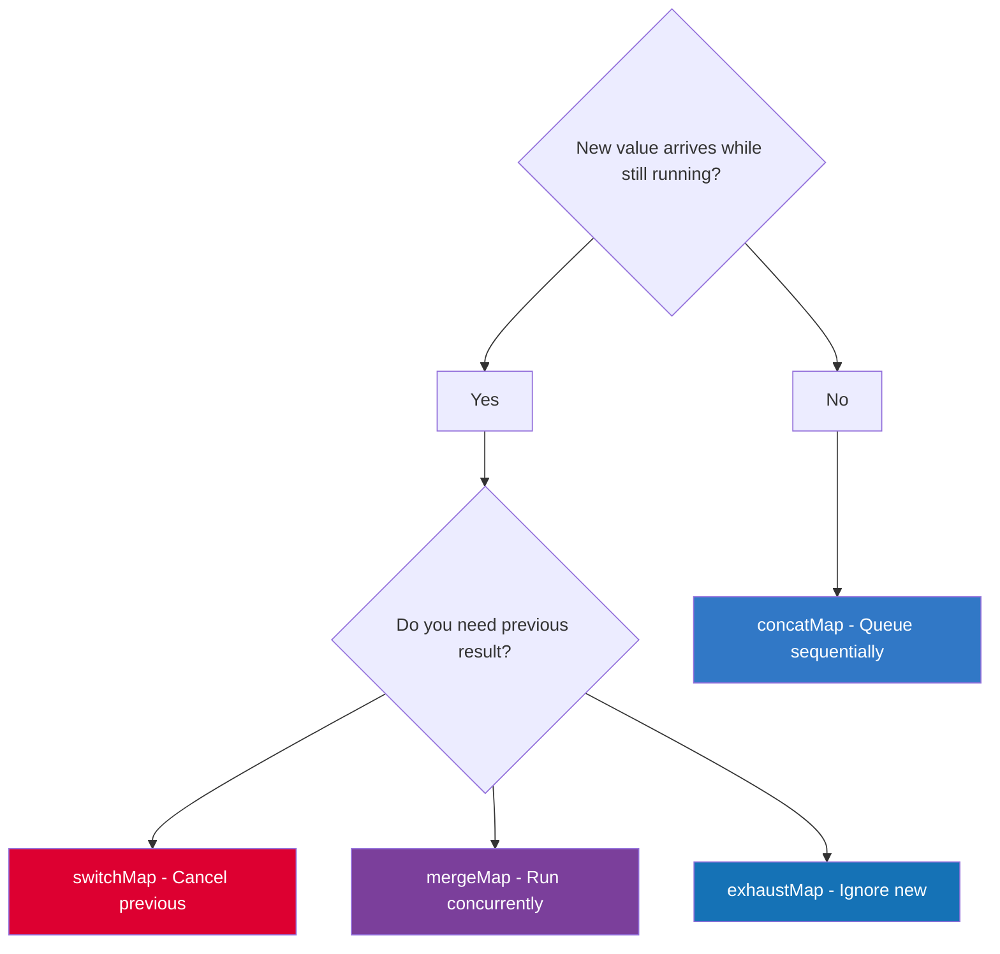

# RxJS Operators

## Which Flattening Operator?



Use cases:
- `switchMap` — search autocomplete (cancel stale requests)
- `mergeMap` — load multiple independent items in parallel
- `concatMap` — save operations that must run in order
- `exhaustMap` — form submit (ignore double-clicks)

---

## Transformation

```typescript
map(user => user.name)           // transform each emission
scan((acc, v) => acc + v, 0)     // accumulate (like Array.reduce)
pairwise()                       // emit [prev, curr] pairs
buffer(signal$)                  // collect into array until signal emits
```

## Filtering

```typescript
filter(n => n > 0)               // pass only matching
take(5)                          // complete after 5
takeWhile(n => n < 10)           // complete when condition false
skip(3)                          // skip first 3
distinctUntilChanged()           // skip if same as previous
distinctUntilKeyChanged('id')    // skip if same key value
debounceTime(300)                // emit after 300ms silence
throttleTime(1000)               // emit then ignore for 1s
first()                          // take first, complete
last()                           // take last (when source completes)
```

## Error Handling

```typescript
catchError(err => of(fallback))  // recover with fallback observable
retry(3)                         // retry up to 3 times
retryWhen(errors => errors.pipe( // exponential backoff
  delayWhen((_, i) => timer(Math.pow(2, i) * 1000))
))
```

## Combination

```typescript
combineLatest([a$, b$])          // emit array when any emits (after all emit once)
forkJoin([a$, b$])               // emit when ALL complete (parallel HTTP)
merge(a$, b$)                    // merge emissions
zip(a$, b$)                      // pair emissions by index
withLatestFrom(b$)               // combine with latest from b$
```

## Flattening (Critical for Interviews)

```typescript
// Cancel previous, start new
switchMap(q => search(q))        // type-ahead search

// Run all concurrently
mergeMap(id => load(id))         // parallel independent requests

// Queue, run sequentially
concatMap(item => save(item))    // sequential save operations

// Ignore new while running
exhaustMap(e => submit(e))       // form submit button
```

## Utility

```typescript
tap(v => console.log(v))         // side effect, pass through
delay(1000)                      // delay each emission
timeout(5000)                    // error if no emission in 5s
startWith(initialValue)          // prepend a value
shareReplay(1)                   // cache latest, replay to new subscribers
finalize(() => cleanup())        // runs on complete, error, or unsubscribe
```

---

## Related Topics

- **Previous:** [Subjects](./subjects)
- **Next:** [Schedulers](./schedulers)
