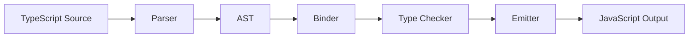

# TypeScript Introduction

## Introduction

TypeScript is a strongly-typed superset of JavaScript developed by Microsoft. It adds optional static types, interfaces, generics, and compile-time checks to JavaScript. Every valid JavaScript program is also valid TypeScript.

Angular is written in TypeScript and requires it. The Angular compiler uses TypeScript's type system to generate optimized code and catch bugs at build time.

---

## Why it matters

- **Catch bugs early** — type errors surface at compile time, not in production
- **Better tooling** — IDEs provide accurate autocomplete, refactoring, and navigation
- **Self-documenting code** — types explain intent without comments
- **Angular integration** — Angular's template compiler uses TypeScript types to type-check templates

---

## TypeScript Compiler Pipeline



The TypeScript compiler (tsc):
1. Parses source into an AST
2. Binds identifiers to declarations
3. Type-checks the AST
4. Emits JavaScript

Angular's compiler (ngc) wraps tsc and additionally type-checks templates.

---

## Core Type System

```typescript
// Primitive types
let name: string = 'Alice';
let age: number = 30;
let active: boolean = true;
let nothing: null = null;
let missing: undefined = undefined;

// Array types
let scores: number[] = [1, 2, 3];
let names: Array<string> = ['Alice', 'Bob'];

// Tuple — fixed-length array with known types
let point: [number, number] = [10, 20];

// Union — one of several types
let id: string | number = 'user-123';

// Literal types — exact values
let direction: 'north' | 'south' | 'east' | 'west' = 'north';

// any — opts out of type checking (avoid)
let data: any = JSON.parse(response);

// unknown — type-safe any
let input: unknown = getUserInput();
if (typeof input === 'string') {
  input.toUpperCase(); // OK — narrowed to string
}
```

---

## Interfaces vs Type Aliases

Both define shapes but have different capabilities:

```typescript
// Interface — extendable, for object shapes
interface User {
  id: string;
  name: string;
  email?: string; // optional
}

interface AdminUser extends User {
  permissions: string[];
}

// Type alias — for unions, intersections, computed types
type ID = string | number;
type UserOrAdmin = User | AdminUser;
type ReadonlyUser = Readonly<User>;

// Both work for object shapes — prefer interface for public APIs
// prefer type for unions, computed, or utility types
```

---

## Generics

Generics allow reusable code that works with multiple types:

```typescript
// Generic function
function first<T>(array: T[]): T | undefined {
  return array[0];
}

const num = first([1, 2, 3]);     // T inferred as number
const str = first(['a', 'b']);    // T inferred as string

// Generic interface
interface ApiResponse<T> {
  data: T;
  status: number;
  message: string;
}

// Angular HTTP client uses generics
this.http.get<User[]>('/api/users')  // returns Observable<User[]>
```

---

## Strict Mode

Enable strict mode in `tsconfig.json` — it's non-negotiable for production Angular apps:

```json
{
  "compilerOptions": {
    "strict": true,
    "strictNullChecks": true,
    "strictFunctionTypes": true,
    "strictPropertyInitialization": true,
    "noImplicitAny": true,
    "noImplicitReturns": true,
    "noUncheckedIndexedAccess": true
  }
}
```

`strict: true` enables all of these at once. `strictNullChecks` is the most important — it forces you to handle `null` and `undefined` explicitly.

---

## Angular and TypeScript

Angular uses TypeScript features extensively:

```typescript
// Decorators define metadata
@Component({
  selector: 'app-root',
  standalone: true,
  template: `<h1>{{ title() }}</h1>`,
})
export class AppComponent {
  // Typed input signal
  title = input.required<string>();

  // Typed injected service
  private readonly userService = inject<UserService>(UserService);

  // Typed output
  readonly userSelected = output<User>();
}

// Interfaces describe data shapes
interface User {
  id: string;
  name: string;
  role: 'admin' | 'editor' | 'viewer';
  createdAt: Date;
}
```

---

## Type Narrowing

TypeScript narrows types based on runtime checks:

```typescript
function processInput(input: string | number | null) {
  if (input === null) {
    console.log('null input');
    return;
  }

  // TypeScript knows input is string | number here
  if (typeof input === 'string') {
    // TypeScript knows it's string here
    console.log(input.toUpperCase());
  } else {
    // TypeScript knows it's number here
    console.log(input.toFixed(2));
  }
}
```

---

## Interview Questions

**Q (Easy): What is the difference between `interface` and `type` in TypeScript?**

Both define type shapes. Interfaces are extendable with `extends`, can be merged (declaration merging), and are best for public API shapes. Type aliases are more flexible — they can represent unions, intersections, mapped types, and conditional types. Prefer `interface` for object shapes that will be extended or implemented. Use `type` for unions, utility types, and computed types.

**Q (Medium): What does `strictNullChecks` do and why should it always be enabled?**

With `strictNullChecks` off, `null` and `undefined` are assignable to all types. This hides bugs where you access a property on a potentially null value. With it on, `null` and `undefined` are their own distinct types. You must explicitly handle nullability — either via union types (`User | null`) or non-null assertion (`user!.name`). This catches an entire class of runtime errors at compile time.

**Q (Hard): Explain the `infer` keyword in conditional types.**

`infer` is used inside `extends` clauses of conditional types to capture and extract a type. For example, `ReturnType<T>` is implemented as `T extends (...args: any[]) => infer R ? R : never` — it infers the return type `R` of function type `T`. This enables TypeScript's powerful utility types and custom type inference patterns.

---

## 30-Second Answer

TypeScript adds static types to JavaScript. It catches type errors at compile time rather than runtime. Key features: interfaces and type aliases for shapes, generics for reusable code, union types for flexibility, and strict mode for maximum safety. Angular requires TypeScript and uses its type system to type-check templates and enforce API contracts.

---

## Cheat Sheet

```typescript
// Types
string | number | boolean | null | undefined | symbol | bigint

// Modifiers
readonly property: T       // immutable
property?: T               // optional
property!: T               // non-null assertion

// Utility types
Partial<T>                 // all properties optional
Required<T>                // all properties required
Readonly<T>                // all properties readonly
Pick<T, K>                 // subset of T
Omit<T, K>                 // T minus K
Record<K, V>               // object with keys K and values V
ReturnType<T>              // return type of function
Parameters<T>              // parameter types of function
NonNullable<T>             // T without null/undefined
```

---

## Summary

TypeScript's type system prevents entire categories of runtime bugs. `strictNullChecks` forces explicit null handling. Generics enable reusable, type-safe abstractions. Angular's deep TypeScript integration — typed templates, typed DI, typed HTTP — makes the combination the most type-safe frontend stack available.

---

## Official References

- [TypeScript Handbook](https://www.typescriptlang.org/docs/)
- [TypeScript Playground](https://www.typescriptlang.org/play)
- [Angular TypeScript Config](https://angular.dev/reference/configs/workspace-config)

---

## Related Topics

- **Next:** [Basic Types](./basic-types)
- **Related:** [Angular Introduction](/docs/angular/introduction)
- **Related:** [JavaScript Introduction](/docs/javascript/introduction)
